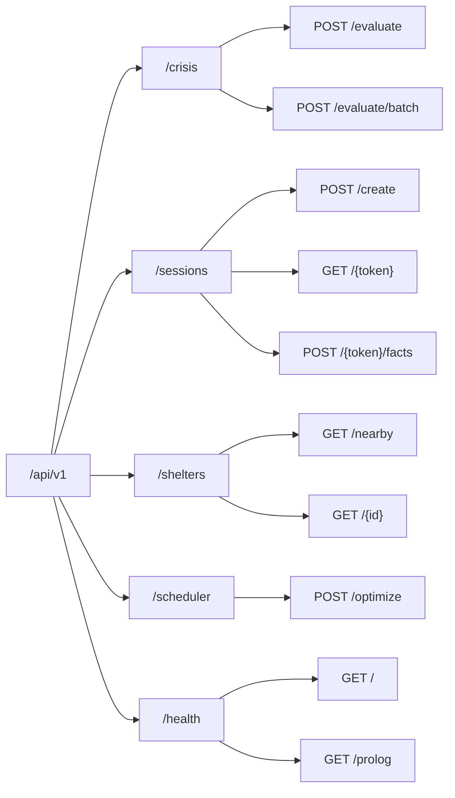
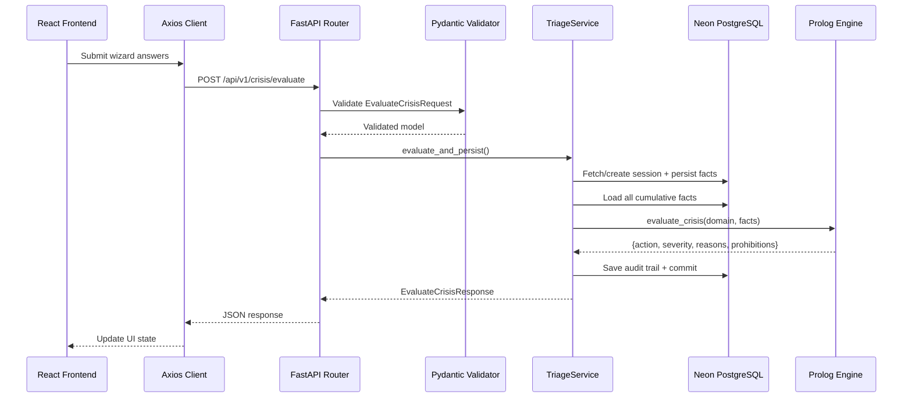

# 🔌 CrisisGuard AI — API Reference

> **Context File** — Complete REST API specification, request/response contracts, frontend integration guide.  
> See also: [structure.md](./structure.md) · [database.md](./database.md)

---

## Base Configuration

| Property | Value |
|----------|-------|
| **Base URL** | `http://localhost:8000/api/v1` |
| **Framework** | FastAPI (Python 3.11+) |
| **Serialization** | Pydantic v2 |
| **Content-Type** | `application/json` |
| **Auth** | None (future phase) |
| **CORS Origins** | `http://localhost:3000`, `http://localhost:5173` |
| **Docs** | `http://localhost:8000/docs` (Swagger), `http://localhost:8000/redoc` |

---

## Endpoint Map



---

## 1. Crisis Triage

### `POST /api/v1/crisis/evaluate`

The **primary endpoint**. Submits facts, runs Prolog reasoning, returns action + severity.

**Request:**
```json
{
  "session_token": "abc123-def456",
  "domain": "medical",
  "submitted_facts": [
    { "key": "unconscious", "value": "true" },
    { "key": "breathing", "value": "none" }
  ]
}
```

**Response (200):**
```json
{
  "session_token": "abc123-def456",
  "domain": "medical",
  "severity": "critical",
  "action_headline": "begin_cpr_and_call_emergency",
  "reasons": [
    "Victim is unconscious and unresponsive with absent respiration.",
    "Immediate chest compressions (100-120 BPM) required.",
    "Request an AED immediately."
  ],
  "prohibited_actions": [
    "Do not give oral fluids or medications.",
    "Do not delay CPR to search for a pulse if untrained.",
    "Do not leave victim unattended."
  ],
  "evaluation_latency_ms": 12
}
```

**Error (422):**
```json
{
  "detail": [
    {
      "loc": ["body", "domain"],
      "msg": "value is not a valid enumeration member",
      "type": "value_error"
    }
  ]
}
```

**Error (500):**
```json
{
  "detail": "Prolog engine evaluation failed: [error details]"
}
```

---

### `POST /api/v1/crisis/evaluate/batch`

Evaluates multiple scenarios in one request.

**Request:**
```json
{
  "evaluations": [
    {
      "session_token": "session-1",
      "domain": "medical",
      "submitted_facts": [{ "key": "bleeding", "value": "severe_pulsing" }]
    },
    {
      "session_token": "session-2",
      "domain": "fire_hazard",
      "submitted_facts": [
        { "key": "hazard", "value": "fire" },
        { "key": "fire_source", "value": "electrical" }
      ]
    }
  ]
}
```

**Response (200):** Array of `EvaluateCrisisResponse` objects.

---

## 2. Sessions

### `POST /api/v1/sessions/create`

Creates a new emergency session. Returns a unique token.

**Request:**
```json
{
  "domain": "medical"
}
```

**Response (201):**
```json
{
  "session_token": "a1b2c3d4-e5f6-7890-abcd-ef1234567890",
  "domain": "medical",
  "current_severity": "moderate",
  "is_active": true,
  "created_at": "2026-08-19T14:00:00Z"
}
```

---

### `GET /api/v1/sessions/{token}`

Retrieves full session including facts and audit history.

**Response (200):**
```json
{
  "session_token": "a1b2c3d4-...",
  "domain": "medical",
  "current_severity": "critical",
  "is_active": true,
  "created_at": "2026-08-19T14:00:00Z",
  "facts": [
    { "key": "unconscious", "value": "true", "created_at": "..." },
    { "key": "breathing", "value": "none", "created_at": "..." }
  ],
  "audit_trail": [
    {
      "recommended_action": "begin_cpr_and_call_emergency",
      "severity": "critical",
      "reasons": ["..."],
      "prohibited_actions": ["..."],
      "evaluation_latency_ms": 12,
      "created_at": "..."
    }
  ]
}
```

**Error (404):**
```json
{ "detail": "Session not found" }
```

---

### `POST /api/v1/sessions/{token}/facts`

Adds facts to an existing session without triggering evaluation.

**Request:**
```json
{
  "facts": [
    { "key": "face_droop", "value": "true" },
    { "key": "arm_weakness", "value": "true" }
  ]
}
```

**Response (200):** Updated facts list.

---

## 3. Shelters

### `GET /api/v1/shelters/nearby`

Finds open shelters near a location.

**Query Parameters:**
| Param | Type | Required | Description |
|-------|------|----------|-------------|
| `lat` | float | ✅ | Latitude |
| `lng` | float | ✅ | Longitude |
| `radius_km` | float | ❌ | Search radius (default: 10) |
| `disaster_type` | string | ❌ | Filter by domain type |

**Response (200):**
```json
{
  "shelters": [
    {
      "id": 1,
      "name": "Central Emergency Shelter",
      "disaster_type": "natural_disaster",
      "latitude": 16.8661,
      "longitude": 96.1951,
      "capacity": 500,
      "current_occupancy": 120,
      "contact_phone": "+95-1-234567",
      "is_open": true,
      "distance_km": 2.3
    }
  ],
  "total": 1
}
```

---

### `GET /api/v1/shelters/{id}`

Single shelter details.

**Response (200):** Single shelter object.

---

## 4. Scheduler

### `POST /api/v1/scheduler/optimize`

Uses CLP(FD) constraint solving to assign rescue teams to incidents.

**Request:**
```json
{
  "incident_severities": ["critical", "high", "moderate", "critical"],
  "team_capacities": [10, 8, 6, 12],
  "max_time": 60
}
```

**Response (200):**
```json
{
  "assignments": [1, 3, 4, 2],
  "optimization_status": "optimal",
  "solving_time_ms": 5
}
```

> **Note:** Critical incidents are constrained to teams 1-2 only. CLP(FD) ensures this invariant.

---

## 5. Health

### `GET /api/v1/health`

```json
{
  "status": "healthy",
  "version": "1.0.0",
  "uptime_seconds": 3600
}
```

### `GET /api/v1/health/prolog`

```json
{
  "prolog_status": "ready",
  "knowledge_bases_loaded": 7,
  "engine_ready": true
}
```

---

## Pydantic Schemas (Data Contracts)

Located in `backend/app/domain/schemas/`:

### `triage.py`
```python
class FactItem(BaseModel):
    key: str
    value: str

class EvaluateCrisisRequest(BaseModel):
    session_token: str
    domain: str                    # medical | natural_disaster | fire_hazard | road_accident
    submitted_facts: list[FactItem]

class EvaluateCrisisResponse(BaseModel):
    session_token: str
    domain: str
    severity: str                  # critical | high | moderate | low | informational
    action_headline: str
    reasons: list[str]
    prohibited_actions: list[str]
    evaluation_latency_ms: int
```

### `session.py`
```python
class CreateSessionRequest(BaseModel):
    domain: str

class SessionResponse(BaseModel):
    session_token: str
    domain: str
    current_severity: str
    is_active: bool
    created_at: datetime
```

### `shelter.py`
```python
class ShelterQuery(BaseModel):
    lat: float
    lng: float
    radius_km: float = 10.0
    disaster_type: str | None = None

class ShelterResponse(BaseModel):
    id: int
    name: str
    disaster_type: str
    latitude: float
    longitude: float
    capacity: int
    current_occupancy: int
    contact_phone: str
    is_open: bool
    distance_km: float | None = None
```

---

## Evaluate Request Flow



---

## Frontend Integration Guide

### TypeScript Types (matching Pydantic schemas)

```typescript
// frontend/src/types/crisis.types.ts

interface FactItem {
  key: string;
  value: string;
}

interface EvaluateCrisisRequest {
  session_token: string;
  domain: 'medical' | 'natural_disaster' | 'fire_hazard' | 'road_accident';
  submitted_facts: FactItem[];
}

interface EvaluateCrisisResponse {
  session_token: string;
  domain: string;
  severity: 'critical' | 'high' | 'moderate' | 'low' | 'informational';
  action_headline: string;
  reasons: string[];
  prohibited_actions: string[];
  evaluation_latency_ms: number;
}

interface SessionResponse {
  session_token: string;
  domain: string;
  current_severity: string;
  is_active: boolean;
  created_at: string;
}

interface ShelterResponse {
  id: number;
  name: string;
  disaster_type: string;
  latitude: number;
  longitude: number;
  capacity: number;
  current_occupancy: number;
  contact_phone: string;
  is_open: boolean;
  distance_km?: number;
}
```

### Axios Client Pattern

```typescript
// frontend/src/services/api.ts
import axios from 'axios';

const api = axios.create({
  baseURL: import.meta.env.VITE_API_URL || 'http://localhost:8000/api/v1',
  headers: { 'Content-Type': 'application/json' },
});

export const crisisApi = {
  evaluate: (data: EvaluateCrisisRequest) =>
    api.post<EvaluateCrisisResponse>('/crisis/evaluate', data),

  createSession: (domain: string) =>
    api.post<SessionResponse>('/sessions/create', { domain }),

  getSession: (token: string) =>
    api.get<SessionResponse>(`/sessions/${token}`),

  nearbyShelters: (lat: number, lng: number, radiusKm = 10) =>
    api.get<{ shelters: ShelterResponse[] }>('/shelters/nearby', {
      params: { lat, lng, radius_km: radiusKm },
    }),

  health: () => api.get('/health'),
};
```

### Component → Endpoint Mapping

| Component | Endpoint | Trigger |
|-----------|----------|---------|
| App.tsx (boot) | `GET /health` | On mount |
| QuestionWizard.tsx | `POST /crisis/evaluate` | Each wizard step |
| ActionCard.tsx | — | Reads evaluate response from store |
| ExplanationDrawer.tsx | — | Reads `reasons[]` from store |
| ProhibitedActions.tsx | — | Reads `prohibited_actions[]` from store |
| CPRMetronome.tsx | — | Activates when `severity === 'critical'` + medical domain |
| EmergencyDialer.tsx | — | Static, no API call |
| Shelter map | `GET /shelters/nearby` | On location permission granted |

---

## CORS Configuration

`backend/app/core/security.py` configures:

```python
CORS_ORIGINS = [
    "http://localhost:3000",    # React production build
    "http://localhost:5173",    # Vite dev server
]
```

FastAPI middleware in `main.py`:
```python
app.add_middleware(
    CORSMiddleware,
    allow_origins=settings.CORS_ORIGINS,
    allow_credentials=True,
    allow_methods=["*"],
    allow_headers=["*"],
)
```
