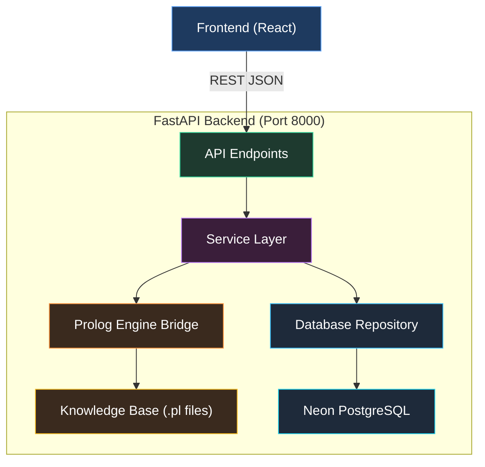
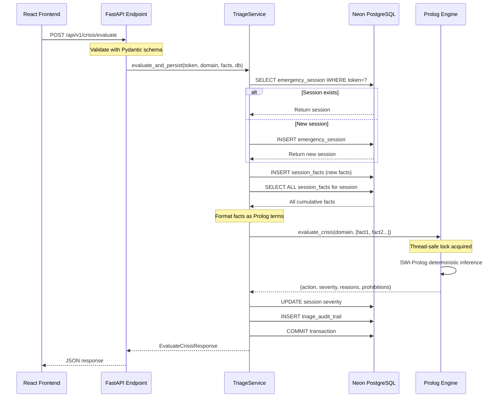

# 🏗️ CrisisGuard AI — Backend Structure & Architecture

> **Context File** — Backend-only architecture reference. For details see: [database.md](./database.md) · [api.md](./api.md) · [prolog.md](./prolog.md)

---

## Architecture Pattern

**Single Unified FastAPI Backend** — all logic runs in one Python process:
- REST API routing & validation (FastAPI + Pydantic v2)
- Symbolic AI inference (SWI-Prolog embedded via PySwip)
- Async database persistence (SQLAlchemy 2.0 + asyncpg → Neon Serverless PostgreSQL)

No microservices. No message queues. Prolog runs in-process = zero network latency for reasoning.

---

## Clean Architecture Layers



| Layer | Directory | Responsibility |
|-------|-----------|----------------|
| **API Endpoints** | `app/api/v1/endpoints/` | HTTP routing, request validation, dependency injection |
| **Schemas** | `app/domain/schemas/` | Pydantic v2 request/response data contracts |
| **Services** | `app/services/` | Business logic, orchestration, transaction management |
| **Prolog Bridge** | `app/prolog/` | Thread-safe PySwip singleton, query building, result parsing |
| **Knowledge Base** | `app/knowledge_base/` | SWI-Prolog rule files (.pl) for all crisis domains |
| **DB Models** | `app/db/models/` | SQLAlchemy ORM models mapping to PostgreSQL tables |
| **Core** | `app/core/` | Config, database engine, security/CORS |

---

## Backend Directory Tree (Actual)

```
backend/
├── .env.example                    # DATABASE_URL, ENVIRONMENT, LOG_LEVEL
├── Dockerfile                      # Python 3.11-slim + SWI-Prolog + uvicorn
├── requirements.txt                # fastapi, pyswip, sqlalchemy, asyncpg, pydantic...
├── pyproject.toml
├── skills.md                       # Backend overview & skills reference
├── structure.md                    # Architecture & clean layers (this file)
├── api.md                          # REST API contracts & documentation
├── database.md                     # Database models, schemas & Neon configuration
├── debugging.md                    # Troubleshooting & health checks
├── progress.md                     # Roadmap & task tracking
├── prolog.md                       # SWI-Prolog rule engine & XAI proof tree guide
├── app/
│   ├── __init__.py
│   ├── main.py                     # FastAPI app + lifespan + CORS + router mount
│   ├── api/
│   │   ├── __init__.py
│   │   ├── deps.py                 # get_db(), get_prolog_engine() dependencies
│   │   └── v1/
│   │       ├── __init__.py
│   │       ├── api_router.py       # Aggregates all endpoint routers → /api/v1
│   │       └── endpoints/
│   │           ├── __init__.py
│   │           ├── crisis.py       # POST /evaluate, POST /evaluate/batch
│   │           ├── health.py       # GET /health, GET /health/prolog
│   │           ├── scheduler.py    # POST /schedule/optimize (CLP(FD))
│   │           ├── sessions.py     # POST /create, GET /{token}, POST /{token}/facts
│   │           └── shelters.py     # GET /nearby, GET /{id}
│   ├── core/
│   │   ├── __init__.py
│   │   ├── config.py               # Pydantic Settings (DATABASE_URL, CORS origins)
│   │   ├── database.py             # Async engine + sessionmaker + get_db
│   │   └── security.py             # CORS middleware config
│   ├── db/
│   │   ├── __init__.py
│   │   ├── base.py                 # SQLAlchemy declarative Base
│   │   └── models/
│   │       ├── __init__.py
│   │       ├── session.py          # EmergencySession (UUID, domain, severity)
│   │       ├── fact.py             # SessionFact (key-value pairs per session)
│   │       ├── audit.py            # TriageAuditTrail (immutable reasoning log)
│   │       └── shelter.py          # EmergencyShelter (geo + capacity)
│   ├── domain/
│   │   ├── __init__.py
│   │   ├── constants.py            # SeverityLevel, DomainType enums
│   │   └── schemas/
│   │       ├── __init__.py
│   │       ├── triage.py           # FactItem, EvaluateCrisisRequest/Response
│   │       ├── session.py          # CreateSession, SessionResponse
│   │       └── shelter.py          # ShelterQuery, ShelterResponse
│   ├── knowledge_base/
│   │   ├── core/
│   │   │   ├── core_rules.pl       # evaluate_emergency/6 dispatcher
│   │   │   ├── scheduler_clpfd.pl  # CLP(FD) resource allocation
│   │   │   └── xai_explainer.pl    # Proof tree generator
│   │   ├── domains/
│   │   │   ├── medical.pl          # CPR, Stroke, Bleeding, Choking
│   │   │   ├── natural_disasters.pl # Flood, Earthquake, Storm, Tsunami
│   │   │   ├── fire_hazards.pl     # Electrical fire, Grease fire, Gas Leak
│   │   │   └── road_accidents.pl   # Crash Triage, Extraction
│   │   └── tests/
│   │       ├── test_medical.pl     # plunit safety tests
│   │       └── test_hazards.pl     # plunit invariant tests
│   ├── prolog/
│   │   ├── __init__.py             # Public facade exports
│   │   ├── engine.py               # PrologEngineBridge (thread-safe singleton)
│   │   ├── query_builder.py        # Python → Prolog term serialization
│   │   ├── parser.py               # Prolog result → Python dict normalization
│   │   ├── scheduler.py            # CLP(FD) dispatch wrapper
│   │   ├── xai.py                  # Proof tree visitor → human explanation
│   │   └── exceptions.py           # PrologError, KBLoadError, QueryTimeoutError
│   └── services/
│       ├── __init__.py
│       ├── prolog_engine.py        # PySwip bridge (compatibility layer)
│       ├── triage_service.py       # Core business logic + DB persistence
│       └── shelter_service.py      # Geolocation shelter queries
└── tests/
    ├── __init__.py
    ├── test_api.py                 # API endpoint integration tests
    └── test_safety_invariants.py   # Prolog safety guardrail tests
```

---

## Request Data Flow

The primary flow for a crisis evaluation request:



---

## Frontend Integration Points

When frontend development begins, it connects to these backend endpoints:

| Frontend Action | Backend Endpoint | What It Gets |
|----------------|------------------|--------------|
| App boot health check | `GET /api/v1/health` | `{status, version, uptime}` |
| Prolog engine status | `GET /api/v1/health/prolog` | `{prolog_status, kb_count, ready}` |
| Start emergency session | `POST /api/v1/sessions/create` | `{session_token, domain, created_at}` |
| Submit wizard answers | `POST /api/v1/crisis/evaluate` | `{severity, action, reasons[], prohibitions[]}` |
| Get session history | `GET /api/v1/sessions/{token}` | Full session + facts + audit trail |
| Find nearby shelters | `GET /api/v1/shelters/nearby` | Array of shelters with distance |
| Resource scheduling | `POST /api/v1/scheduler/optimize` | CLP(FD) team assignments |

> **Key Contract**: The frontend's `QuestionWizard` component sends accumulated `FactItem[]` on each step. The backend's Prolog engine evaluates ALL cumulative facts, so the response refines with each answer.

---

## Key Design Decisions

1. **Embedded Prolog (not API)** — SWI-Prolog runs inside the Python process via PySwip C bindings. Zero network hop for reasoning = sub-millisecond inference.
2. **Thread-safe singleton** — `PrologEngineBridge` uses `threading.Lock` because SWI-Prolog is not thread-safe. FastAPI async handlers delegate Prolog calls to the threadpool.
3. **Cumulative fact model** — Facts are append-only per session. Every evaluation loads ALL facts for that session, enabling progressive refinement.
4. **Immutable audit trail** — Every evaluation result is persisted as a `TriageAuditTrail` record. No updates, only inserts.
5. **Safe fallback** — If Prolog fails for any reason, the engine returns `call_emergency_services_immediately` at `critical` severity. The system NEVER returns empty/null advice.
