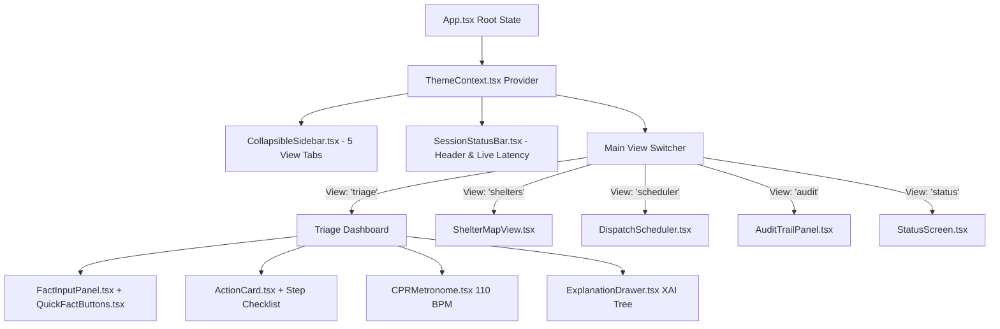

# 🛡️ CrisisGuard AI — Frontend Engineering Skills & Extension Blueprint (frontendskills.md)

> **Version:** 3.2.0  
> **Tech Stack:** TypeScript 5.7 • React 18.3 • Vite 6 • Tailwind CSS 4 • Express 4 • Web Audio API • Web Speech API  
> **Purpose:** Comprehensive developer handbook for contributors building UI components, maintaining life-safety standards, adding emergency domains, and optimizing deterministic triage workflows.

---

## 📑 Table of Contents

1. [System Overview & Engineering Philosophy](#1-system-overview--engineering-philosophy)
2. [Frontend Architecture & Tech Stack](#2-frontend-architecture--tech-stack)
3. [Core Engineering & Life-Safety Principles](#3-core-engineering--life-safety-principles)
4. [Component Architecture & View System](#4-component-architecture--view-system)
5. [Rule Engine & Deterministic Logic Integration](#5-rule-engine--deterministic-logic-integration)
6. [Emergency Domains & Evaluation Matrix](#6-emergency-domains--evaluation-matrix)
7. [Step-by-Step Guide: Adding a New Emergency Domain](#7-step-by-step-guide-adding-a-new-emergency-domain)
8. [CLP(FD) Symbolic Constraint Dispatcher](#8-clpfd-symbolic-constraint-dispatcher)
9. [Skeuomorphic UI Design System & Haptic Feedback](#9-skeuomorphic-ui-design-system--haptic-feedback)
10. [Web Audio 110 BPM Metronome & Voice Synthesis](#10-web-audio-110-bpm-metronome--voice-synthesis)
11. [Emergency Shelter Geolocation & Haversine Engine](#11-emergency-shelter-geolocation--haversine-engine)
12. [Explainable AI (XAI) Proof Trees](#12-explainable-ai-xai-proof-trees)
13. [Testing, Type Verification & Quality Checklist](#13-testing-type-verification--quality-checklist)

---

## 1. System Overview & Engineering Philosophy

**CrisisGuard AI** is a safety-critical, explainable decision support system for emergency triage, first responders, and disaster management.

Unlike probabilistic Large Language Models (LLMs) that may hallucinate during high-stress crises, CrisisGuard AI relies on **deterministic Symbolic AI (Horn-clause logic and CLP(FD) constraint solving)** to guarantee that every recommendation is logically proven, fully traceable, and sub-millisecond fast.

### Key Goals
- **Zero Hallucination**: Every life-safety action is deduced strictly from asserted observations against verified rules.
- **Explicit Safety Invariants**: Every emergency outcome explicitly outputs forbidden actions (e.g., *"NEVER pour water on electrical or grease fires"*).
- **Explainability (XAI)**: Decisions trace back to concrete deduction steps and evidence in interactive proof trees.
- **Sub-5ms Inference**: In-process logic evaluation delivers near-zero latency triage.
- **Resilient Multi-Modal UI**: 3D skeuomorphic tactile buttons, 110 BPM audio-visual CPR metronome, and hands-free voice synthesis.

---

## 2. Frontend Architecture & Tech Stack

| Layer | Technology | Description |
|---|---|---|
| **Framework** | **React 18.3** (TypeScript 5.7) | Functional components with hooks, strict typing, and clean separation of concerns. |
| **Bundler & Server** | **Vite 6** + **Express 4** | Unified Express server (`server.ts`) providing Vite middleware in dev and static asset serving in prod. |
| **Styling & Tokens** | **Tailwind CSS 4** + Custom Tokens | Modern Tailwind 4 `@import "tailwindcss";` with CSS custom variables, amber/gold accent system, and skeuomorphic styling. |
| **Icons & Animation** | **lucide-react 1.16** + **motion 12** | Clean vector iconography and spring-physics animations. |
| **Audio Synthesizer** | **Web Audio API** (`AudioContext`) | Hardware-synchronized 110 BPM sine oscillator for CPR chest compressions. |
| **Voice Synthesis** | **Web Speech API** (`SpeechSynthesis`) | Hands-free emergency audio guidance queue with high-priority voice selection. |
| **State & Storage** | **React State** + `localStorage` | Token persistence, dynamic key-value fact assertion, and reactive view state. |

---

## 3. Core Engineering & Life-Safety Principles

1. **Deterministic Logic Over Probabilistic Predictions**:
   - Critical life-safety actions must never hallucinate. Every triage recommendation is derived from deterministic rules and constraints.
2. **Explicit Safety Invariants & Prohibitions**:
   - Every emergency outcome must explicitly output forbidden actions with high-contrast red alert styling (`ProhibitionsList.tsx`).
3. **Fail-Safe Fallback**:
   - If an unexpected fact combination or unhandled domain is encountered, the system defaults to `safeFallback()`: `CALL_EMERGENCY_SERVICES_IMMEDIATELY` at `critical` severity.
4. **Sub-Millisecond Evaluation Latency**:
   - In-memory rule evaluations execute in < 5ms with zero network overhead.
5. **Single-Handed & High-Stress Accessibility**:
   - Large tactile hit targets (≥ 44px), tactile haptic depressions, high-contrast dark/light/alert themes, and clear color coding.

---

## 4. Component Architecture & View System

The application layout is organized around a collapsible left taskbar (`CollapsibleSidebar.tsx`) and a dynamic multi-view workspace managed in `App.tsx`:



### The 5 Primary Views

1. **`'triage'` — Crisis Triage & Directive Evaluation**:
   - Key-value fact assertion, domain selector, preset quick facts, and primary action directive card with interactive step checklist, prohibitions, reasons, and voice synthesis.
2. **`'shelters'` — Emergency Shelters & Geolocation Map**:
   - Browser geolocation detection (`navigator.geolocation`), Haversine distance calculations, domain filtering, and real-time facility badges.
3. **`'scheduler'` — CLP(FD) Resource Dispatch Scheduler**:
   - Rescue fleet capacity matching, multi-criteria constraint solver, and arrival time estimations.
4. **`'audit'` — Session Audit Trail & XAI History**:
   - Chronological evaluation history, latency analytics, fact snapshots, and immutable logging.
5. **`'status'` — System & Rulebase Health**:
   - Real-time monitor of compiled rule modules, rule counts, database state, and runtime metrics.

---

## 5. Rule Engine & Deterministic Logic Integration

The deterministic logic engine resides in `src/server/ruleEngine.ts` and is instantiated as a singleton (`ruleEngine`).

### Architecture Pattern

```text
src/server/ruleEngine.ts
├── PrologRuleEngine (Class)
│   ├── evaluate(domain, facts)           # Master evaluation entrypoint
│   ├── registerDomainEvaluator(name, fn) # Dynamic plugin evaluator registration
│   ├── evalMedical(factsMap)             # Medical emergency rules
│   ├── evalFireHazards(factsMap)         # Fire & Hazmat rules
│   ├── evalNaturalDisasters(factsMap)    # Flood, Quake, Tsunami rules
│   ├── evalRoadAccidents(factsMap)       # Vehicle trauma & START triage
│   ├── safeFallback(facts, domain)       # Invariant fallback protection
│   └── solveDispatchCLPFD(inc, teams)    # CLP(FD) finite domain fleet solver
```

### Data Contract (`src/types.ts`)

```typescript
export interface RuleEvaluationResult {
  action: string;
  severity: TriageSeverity; // 'critical' | 'high' | 'moderate' | 'low' | 'informational'
  step_by_step_instructions: string[];
  reasons: string[];
  prohibited_actions: string[];
  proof_tree: ProofNode;
}
```

---

## 6. Emergency Domains & Evaluation Matrix

| Domain | Key Invariants & Symptoms | Deterministic Action | Severity | Prohibited Actions |
|---|---|---|---|---|
| **Medical** | Unconscious + absent/agonal breathing | `BEGIN_CPR_AND_CALL_EMERGENCY` | `critical` | DO NOT give oral fluids; DO NOT delay CPR for pulse check |
| **Medical** | Choking + blocked airway | `PERFORM_HEIMLICH_THRUSTS` | `critical` | DO NOT perform blind finger sweeps; DO NOT offer water |
| **Medical** | Severe pulsing arterial bleeding | `APPLY_DIRECT_PRESSURE_AND_TOURNIQUET` | `critical` | DO NOT remove soaked dressings; DO NOT apply over joints |
| **Medical** | Face droop / Arm weakness / Slurred speech | `ACTIVATE_STROKE_EMERGENCY_DISPATCH` | `critical` | DO NOT administer aspirin; DO NOT allow patient to drive |
| **Medical** | Chemical / thermal eye burn | `CONTINUOUS_WATER_IRRIGATION_15MIN` | `high` | DO NOT rub affected eye; DO NOT apply neutralizing chemicals |
| **Fire Hazard** | Electrical source fire | `ISOLATE_MAIN_POWER_AND_USE_CO2_EXTINGUISHER` | `critical` | **NEVER THROW WATER ON AN ELECTRICAL FIRE** |
| **Fire Hazard** | Kitchen cooking oil / grease fire | `COVER_WITH_METAL_LID_AND_TURN_OFF_BURNER` | `critical` | **NEVER POUR WATER ON BURNING OIL**; DO NOT move pan |
| **Fire Hazard** | Gas leak / rotten egg odor | `EVACUATE_IMMEDIATELY_NO_SWITCHES_OR_FLAMES` | `critical` | DO NOT operate light switches, phones, or open flames |
| **Natural Disaster** | Flash flood rising rapidly | `MOVE_TO_HIGHEST_GROUND_AVOID_BASEMENTS` | `critical` | DO NOT walk or drive through moving water (Turn Around Don't Drown) |
| **Natural Disaster** | Active earthquake shaking | `DROP_COVER_AND_HOLD_ON` | `high` | DO NOT run outside during shaking; DO NOT use elevators |
| **Road Accident** | Multiple vehicle pileup with trapped victims | `ESTABLISH_SCENE_PERIMETER_AND_TRIAGE` | `critical` | DO NOT move victims unless immediate explosion/fire risk |

---

## 7. Step-by-Step Guide: Adding a New Emergency Domain

Adding a new crisis domain is designed to be completed in **3 modular steps**:

### Step 1: Implement the Domain Evaluator
In `src/server/ruleEngine.ts` (or a modular evaluator file), write the evaluator matching `DomainEvaluator`:

```typescript
import { RuleEvaluationResult, DomainEvaluator } from './ruleEngine';

export const evalHazmatChemical: DomainEvaluator = (facts: Map<string, any>): RuleEvaluationResult => {
  const gasColor = String(facts.get('gas_color') || '').toLowerCase();
  const respiratoryDistress = facts.get('respiratory_distress') === true || facts.get('respiratory_distress') === 'true';

  if (gasColor === 'chlorine_yellow' || respiratoryDistress) {
    return {
      action: 'EVACUATE_UPWIND_AND_SEAL_RESPIRATORY_BARRIER',
      severity: 'critical',
      step_by_step_instructions: [
        'Move immediately upwind and uphill away from vapor plumes.',
        'Cover nose and mouth with a wet cloth or chemical respirator.',
        'Notify Hazmat emergency dispatch (911/112) with placard number.'
      ],
      reasons: [
        'Dense chlorine gas settles into low-lying areas and reacts rapidly with lung tissue.',
        'Immediate respiratory isolation is required to prevent acute pulmonary edema.'
      ],
      prohibited_actions: [
        'DO NOT move downwind or enter basements.',
        'DO NOT touch pooled liquid runoff.'
      ],
      proof_tree: {
        type: 'rule',
        label: 'hazmat_rule_01: TOXIC_GAS_ISOLATION',
        details: 'gas_color(chlorine_yellow) ∨ respiratory_distress(true) ⇒ evacuate_upwind',
        children: [
          { type: 'evidence', label: `Observed gas color: ${gasColor}` },
          { type: 'deduction', label: 'Toxic chemical vapor dispersion detected' },
          { type: 'safety_invariant', label: 'Safety Invariant: Upwind evacuation mandatory' }
        ]
      }
    };
  }

  // Precautionary fallback
  return ruleEngine.safeFallback([], 'medical');
};
```

### Step 2: Register the Evaluator
Register it with `ruleEngine`:

```typescript
import { ruleEngine } from './src/server/ruleEngine';
import { evalHazmatChemical } from './evalHazmatChemical';

ruleEngine.registerDomainEvaluator('hazmat', evalHazmatChemical);
```

### Step 3: Add UI Presets
In `src/data/quickFacts.ts`, add user-friendly preset buttons:

```typescript
{
  id: 'hazmat_chlorine',
  title: 'Chlorine Gas Leak',
  domain: 'hazmat',
  facts: [
    { key: 'gas_color', value: 'chlorine_yellow' },
    { key: 'respiratory_distress', value: 'true' }
  ]
}
```

---

## 8. CLP(FD) Symbolic Constraint Dispatcher

The rescue fleet scheduler in `src/server/ruleEngine.ts` (`solveDispatchCLPFD()`) models finite domain constraint satisfaction:

1. **Capacity Invariant**: `Team Vehicle Capacity >= Incident Victim Count`.
2. **Specialization Invariant**: `Critical Incidents` are strictly routed to `Paramedic` or `Fire Rescue` units.
3. **No Double Booking**: Each rescue team is assigned to at most one incident per dispatch round.
4. **Urgency Sorting**: Incidents are prioritized in strict order: `critical (1)` → `high (2)` → `moderate (3)` → `low (4)`.

---

## 9. Skeuomorphic UI Design System & Haptic Feedback

CrisisGuard AI uses a specialized design system optimized for emergency contexts:

### 3D Tactile Buttons (`HapticButton.tsx`)
- **Apple Spring Physics**: `var(--ease-spring)` (`cubic-bezier(0.34, 1.56, 0.64, 1)`).
- **Physical Depression**: Active state translates down `translateY(3px)` with adjusted inset drop shadows.
- **Material Ripples**: Dynamic radial expansion on touch/click (`.ripple-dot`).
- **Amber Glow CTA**: `.skeuo-btn-amber` with 3D gradient and gold luminescence (`#FFAB00` / `#FFD000`).

### Theme Token Architecture (`src/index.css`)

```css
:root {
  --accent-primary: #FFAB00;              /* Main emergency gold */
  --accent-glow:    #FFD000;              /* Interactive hover shine */
  --alert-critical: #EF4444;              /* Life-safety red alert */
  --alert-border:   rgba(239, 68, 68, 0.40);
  --bg-base:        #090909;              /* Deep dark canvas */
  --bg-surface:     #111111;              /* Card surfaces */
  --border-base:    #2A2A2A;              /* Subtle dividers */
}
```

---

## 10. Web Audio 110 BPM Metronome & Voice Synthesis

### 110 BPM Audio Synthesizer (`CPRMetronome.tsx`)
- Configured to **110 BPM** (~545.45 ms interval) compliant with AHA/ERC resuscitation guidelines.
- Uses `AudioContext` with `createOscillator()`:
  - Standard compression tick: `880 Hz` sine wave.
  - Accent tick: `1046.5 Hz` (C6) on key cycle markers.
- Cycle counter tracking standard adult **30 compressions : 2 rescue breaths** ratio.

### Hands-Free Voice Guidance (`src/utils/textToSpeech.ts`)
- Leverages `window.speechSynthesis`.
- Automatically formats emergency headlines, reasons, and prohibited actions into clear, spoken voice commands for first responders whose hands are occupied.

---

## 11. Emergency Shelter Geolocation & Haversine Engine

Located in `src/components/emergency/ShelterMapView.tsx` and `src/server/database.ts`:

- **Real-Time Geolocation**: Queries `navigator.geolocation.getCurrentPosition()`.
- **Haversine Distance**:
  $$\Delta d = 2R \arcsin\left(\sqrt{\sin^2\left(\frac{\Delta \phi}{2}\right) + \cos(\phi_1)\cos(\phi_2)\sin^2\left(\frac{\Delta \lambda}{2}\right)}\right)$$
- **Facility Filtering**: Live search for Trauma bays, Helipads, Clean water, Infant care, and Boat staging.

---

## 12. Explainable AI (XAI) Proof Trees

Decisions are rendered in `ExplanationDrawer.tsx` from recursive `ProofNode` structures:

```typescript
export interface ProofNode {
  type: 'evidence' | 'rule' | 'deduction' | 'safety_invariant';
  label: string;
  details?: string;
  children?: ProofNode[];
}
```

First responders can click **"Inspect Proof Tree"** on any directive to inspect the exact rules and observations that justified the recommendation.

---

## 13. Testing, Type Verification & Quality Checklist

Before committing or submitting pull requests:

1. **TypeScript Type Verification**:
   ```bash
   npm run lint
   # Runs: tsc --noEmit
   ```
2. **Build Verification**:
   ```bash
   npm run build
   # Runs Vite frontend build + esbuild server bundle
   ```
3. **Safety Verification**:
   - Ensure every new rule contains at least one explicit prohibition in `prohibited_actions`.
   - Ensure latency remains under 5ms.
   - Verify that all emergency presets in `quickFacts.ts` produce valid deterministic conclusions.
