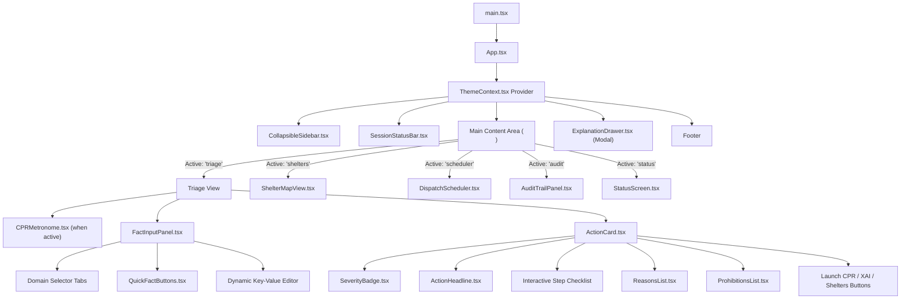
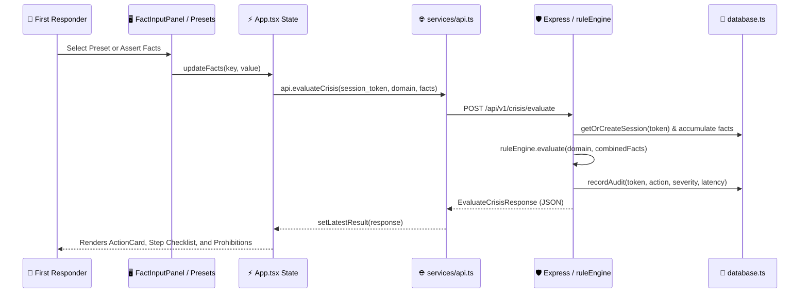

# 🏛️ CrisisGuard AI — Frontend Architecture & Structural Map (frontendstructure.md)

> **Version:** 3.2.0  
> **Tech Stack:** React 18.3 • TypeScript 5.7 • Vite 6 • Tailwind CSS 4 • Express 4  
> **Scope:** Complete structural map, component hierarchy, state flow, and directory layout for the CrisisGuard AI frontend application.

---

## 📑 Table of Contents

1. [Project Directory Layout](#1-project-directory-layout)
2. [Component Hierarchy & Responsibilities](#2-component-hierarchy--responsibilities)
3. [Data & State Flow Architecture](#3-data--state-flow-architecture)
4. [API & Service Layer Specifications](#4-api--service-layer-specifications)
5. [Theme & Aesthetic Token System](#5-theme--aesthetic-token-system)
6. [Type Definitions & Data Models](#6-type-definitions--data-models)
7. [Adding New Views & Features](#7-adding-new-views--features)

---

## 1. Project Directory Layout

```text
CrisisGuardAI/
├── index.html                            # HTML entry point with Amber palette tokens & error suppressors
├── metadata.json                         # Platform applet metadata & permissions
├── package.json                          # Dependencies & NPM build/dev scripts
├── tsconfig.json                         # Strict TypeScript compiler options
├── vite.config.ts                        # Vite 6 bundler config with Tailwind CSS 4 integration
├── server.ts                             # Unified Express 4 + Vite dev/prod server
├── README.md                             # Project overview & quickstart guide
├── frontendskills.md                     # Frontend engineering & skills blueprint
├── frontendstructure.md                  # Frontend system architecture & structure (this document)
│
├── backend/                              # FastAPI + SWI-Prolog Backend Package
│   ├── skills.md                         # Backend system overview & context index
│   ├── structure.md                      # Backend clean architecture & directory tree
│   ├── api.md                            # REST API contracts & Pydantic schemas
│   ├── database.md                       # PostgreSQL schema & Neon async configuration
│   ├── debugging.md                      # Backend troubleshooting & health checks
│   ├── progress.md                       # Backend phase tracker & milestones
│   └── prolog.md                         # SWI-Prolog knowledge bases & CLP(FD) scheduler
│
└── src/
    ├── main.tsx                          # React DOM 18 mounting & root initialization
    ├── App.tsx                           # Master application layout, view switcher & state
    ├── types.ts                          # Shared TypeScript interfaces, types & enums
    ├── index.css                         # Tailwind CSS 4 setup, amber tokens & skeuomorphic styles
    │
    ├── context/
    │   └── ThemeContext.tsx              # Dark (#090909) / Light (#F8FAFC) / Alert theme provider
    │
    ├── services/
    │   └── api.ts                        # Typed client-side REST API wrapper
    │
    ├── utils/
    │   ├── humanizeAction.ts             # Snake_case to Title Case text formatter
    │   ├── severityColor.ts              # Centralized severity color mapping helper
    │   └── textToSpeech.ts               # Web Speech API emergency voice synthesis manager
    │
    ├── data/
    │   └── quickFacts.ts                 # Pre-configured crisis presets for one-tap simulations
    │
    ├── server/                           # In-process backend services executed by server.ts
    │   ├── database.ts                   # In-memory session store, audit logger & shelter DB
    │   └── ruleEngine.ts                 # Deterministic Horn-clause logic & CLP(FD) solver
    │
    ├── components/
    │   ├── ui/
    │   │   └── HapticButton.tsx          # 3D tactile skeuomorphic button with Apple spring physics
    │   │
    │   └── emergency/
    │       ├── Header.tsx                # Top navigation header component
    │       ├── SessionStatusBar.tsx      # Top header with session token, latency & domain tag
    │       ├── CollapsibleSidebar.tsx    # Left navigation taskbar with collapse/expand (Ctrl+B)
    │       ├── FactInputPanel.tsx        # Dynamic key-value fact assertion & domain picker
    │       ├── QuickFactButtons.tsx      # Mobile & desktop tactile preset buttons
    │       ├── ActionCard.tsx            # Primary triage directive card with step checklist
    │       ├── ActionHeadline.tsx        # High-visibility action headline with icon styling
    │       ├── SeverityBadge.tsx         # Color-coded triage severity badge with live ping ring
    │       ├── ReasonsList.tsx           # Bulleted logical/medical deduction justifications
    │       ├── ProhibitionsList.tsx      # Life-safety "DO NOT" forbidden actions alert box
    │       ├── CPRMetronome.tsx          # 110 BPM Web Audio synthesizer & pulsing heart graphic
    │       ├── ExplanationDrawer.tsx     # XAI proof tree modal with interactive node hierarchy
    │       ├── ShelterMapView.tsx        # Geolocation shelter locator & Haversine distance
    │       ├── ShelterLocator.tsx        # Standalone shelter search list widget
    │       ├── DispatchScheduler.tsx     # CLP(FD) constraint solving fleet dispatcher
    │       ├── AuditTrailPanel.tsx       # Searchable chronological inference audit trail
    │       ├── AuditHistory.tsx          # Compact session audit history drawer component
    │       ├── QuestionWizard.tsx        # Step-by-step diagnostic triage questionnaire
    │       └── StatusScreen.tsx          # System health check & compiled rulebase monitor
```

---

## 2. Component Hierarchy & Responsibilities



### Detailed Component Summary

| Component | Path | Key Props / State | Responsibilities |
|---|---|---|---|
| **`App`** | `src/App.tsx` | `sessionToken`, `domain`, `facts`, `latestResult`, `activeView`, `isSidebarCollapsed` | Master state coordinator, view switching, keyboard shortcuts (`Ctrl+B`), and theme wrapper. |
| **`CollapsibleSidebar`** | `src/components/emergency/CollapsibleSidebar.tsx` | `activeView`, `onChangeView`, `currentSeverity`, `isCollapsed`, `onToggleCollapse` | Left navigation rail with 5 tab buttons, theme toggler, and emergency status badge. |
| **`SessionStatusBar`** | `src/components/emergency/SessionStatusBar.tsx` | `sessionToken`, `currentSeverity`, `domain`, `activeView`, `evaluationLatencyMs` | Top header displaying active session token, reasoning latency in milliseconds, and mobile hamburger. |
| **`FactInputPanel`** | `src/components/emergency/FactInputPanel.tsx` | `domain`, `facts`, `onAddFact`, `onRemoveFact`, `onClearFacts`, `onEvaluate` | Dynamic observation editor, custom key-value adder, active fact tags, and preset launcher. |
| **`QuickFactButtons`** | `src/components/emergency/QuickFactButtons.tsx` | `domain`, `activeFacts`, `onApplyPreset` | One-tap emergency preset buttons loaded from `src/data/quickFacts.ts`. |
| **`ActionCard`** | `src/components/emergency/ActionCard.tsx` | `result`, `onOpenProofTree`, `onOpenMetronome`, `onOpenShelters` | Primary directive display, interactive step checklist, prohibitions, reasons, and TTS speech synthesis. |
| **`CPRMetronome`** | `src/components/emergency/CPRMetronome.tsx` | `onClose` | Web Audio API 110 BPM synthesizer, pulsing visual heart, and 30:2 compression-to-breath cycle counter. |
| **`ExplanationDrawer`** | `src/components/emergency/ExplanationDrawer.tsx` | `isOpen`, `onClose`, `proofTree`, `actionHeadline` | Slide-over inspectable XAI proof tree displaying evidence, rules, and deduction chains. |
| **`ShelterMapView`** | `src/components/emergency/ShelterMapView.tsx` | `initialDomain` | Geolocation shelter locator calculating Haversine distance, facility badges, and occupancy trackers. |
| **`DispatchScheduler`** | `src/components/emergency/DispatchScheduler.tsx` | Internal state: `incidents`, `teams`, `dispatchResult` | CLP(FD) finite domain fleet dispatcher assigning rescue teams to incidents by capacity & priority. |
| **`AuditTrailPanel`** | `src/components/emergency/AuditTrailPanel.tsx` | `sessionToken` | Searchable chronological log of all inference runs, fact snapshots, and evaluation latencies. |
| **`StatusScreen`** | `src/components/emergency/StatusScreen.tsx` | Internal state: `healthData` | Live health check verifying rulebases, rule counts, database connection, and API uptime. |
| **`HapticButton`** | `src/components/ui/HapticButton.tsx` | `variant`, `size`, `isPressed`, `onClick` | 3D tactile skeuomorphic button with Apple spring physics, Material ripple animations, and haptics. |

---

## 3. Data & State Flow Architecture



---

## 4. API & Service Layer Specifications

Client service wrapper located in `src/services/api.ts`:

| Method | Endpoint | Method Type | Payload / Params | Return Type |
|---|---|---|---|---|
| `evaluateCrisis` | `/api/v1/crisis/evaluate` | `POST` | `EvaluateCrisisRequest` | `Promise<EvaluateCrisisResponse>` |
| `getSession` | `/api/v1/sessions/:token` | `GET` | Route param: `token` | `Promise<EmergencySession>` |
| `getSessionAudit` | `/api/v1/sessions/:token/audit` | `GET` | Route param: `token` | `Promise<TriageAuditTrail[]>` |
| `getAllAudits` | `/api/v1/audit/all` | `GET` | None | `Promise<TriageAuditTrail[]>` |
| `getNearbyShelters`| `/api/v1/shelters/nearby` | `GET` | `lat, lon, radius_km, disaster_type` | `Promise<{ total_found: number; shelters: EmergencyShelter[] }>` |
| `solveDispatch` | `/api/v1/scheduler/dispatch` | `POST` | `{ incidents: IncidentItem[]; teams: RescueTeam[] }` | `Promise<DispatchResponse>` |

---

## 5. Theme & Aesthetic Token System

Managed via `src/context/ThemeContext.tsx` and configured in `src/index.css`:

### 1. Theme Modes
- **Dark Mode (`'dark'`, Default)**:
  - Background Canvas: `#090909`
  - Card Surface: `#111111`
  - Borders: `#2A2A2A`
  - Text Primary: `#F5F5F5`
- **Light Mode (`'light'`)**:
  - Background Canvas: `#F8FAFC`
  - Card Surface: `#FFFFFF`
  - Borders: `#E2E8F0`
  - Text Primary: `#0F172A`
- **Alert Mode (`'alert'`)**:
  - Background Canvas: `#090909` with pulsing red border ring (`ring-1 ring-red-500/30`)

### 2. Accent & Severity Tokens
- **Amber / Gold Accent**:
  - Base: `#FFAB00` (`var(--accent-primary)`)
  - Glow / Shine: `#FFD000` (`var(--accent-glow)`)
  - Hover Tint: `rgba(255, 171, 0, 0.16)`
- **Alert & Critical Prohibitions**:
  - Primary Red: `#EF4444` (`var(--alert-critical)`)
  - Alert Tint: `rgba(239, 68, 68, 0.10)`
  - Alert Border: `rgba(239, 68, 68, 0.40)`

---

## 6. Type Definitions & Data Models

Located in `src/types.ts`:

```typescript
export type TriageSeverity = 'critical' | 'high' | 'moderate' | 'low' | 'informational';
export type CrisisDomain = 'medical' | 'natural_disaster' | 'fire_hazard' | 'road_accident';

export interface FactItem {
  key: string;
  value: string | boolean | number;
}

export interface ProofNode {
  type: 'evidence' | 'rule' | 'deduction' | 'safety_invariant';
  label: string;
  details?: string;
  children?: ProofNode[];
}

export interface EvaluateCrisisResponse {
  session_token: string;
  domain: CrisisDomain;
  severity: TriageSeverity;
  action_headline: string;
  step_by_step_instructions: string[];
  reasons: string[];
  prohibited_actions: string[];
  proof_tree: ProofNode;
  evaluation_latency_ms: number;
  timestamp: string;
}

export interface EmergencyShelter {
  id: number;
  name: string;
  disaster_type: CrisisDomain | 'general';
  address: string;
  latitude: number;
  longitude: number;
  capacity: number;
  current_occupancy: number;
  contact_phone: string;
  is_open: boolean;
  facilities: string[];
  distance_km?: number;
}

export interface DispatchPlan {
  incident_id: string;
  incident_name: string;
  severity: TriageSeverity;
  assigned_team_id: number;
  team_name: string;
  estimated_arrival_minutes: number;
  constraints_satisfied: string[];
}
```

---

## 7. Adding New Views & Features

1. **Creating a New View**:
   - Create your view component in `src/components/emergency/MyNewView.tsx`.
   - Add the view key to `App.tsx`'s `activeView` union type:
     ```typescript
     const [activeView, setActiveView] = useState<'triage' | 'shelters' | 'scheduler' | 'audit' | 'status' | 'mynewview'>('triage');
     ```
   - Add an entry and icon in `src/components/emergency/CollapsibleSidebar.tsx`.
   - Render the component conditionally inside `<main>` in `App.tsx`.

2. **Extending Knowledge Bases & Presets**:
   - Register domain logic in `src/server/ruleEngine.ts` via `ruleEngine.registerDomainEvaluator()`.
   - Add quick-launch testing presets in `src/data/quickFacts.ts`.
