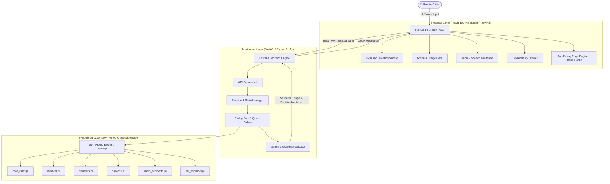
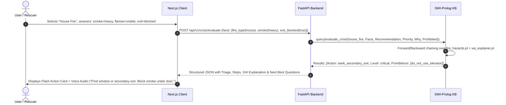

# 🛡️ CrisisGuard AI — Engineering & Architecture Blueprint (skills.md)

> **Version:** 1.0.0  
> **Target System:** Intelligent Crisis Decision Support & Emergency Response System  
> **Role Standard:** Senior Principal Full-Stack & AI Systems Architect  
> **Core Paradigms:** Rule-Based Symbolic AI (Prolog) + Modern Full-Stack (FastAPI / Next.js TypeScript) + Explainable AI (XAI) + Offline-First Resilience  

---

## 📑 Table of Contents

1. [Executive Overview & Mission](#1-executive-overview--mission)
2. [High-Level Architecture & Tech Stack](#2-high-level-architecture--tech-stack)
3. [Project Directory Structure](#3-project-directory-structure)
4. [Symbolic AI & Prolog Knowledge Base Engine](#4-symbolic-ai--prolog-knowledge-base-engine)
   - [4.1 Architecture & Reasoning Flow](#41-architecture--reasoning-flow)
   - [4.2 Domain-Specific Rulebases](#42-domain-specific-rulebases)
   - [4.3 Explainable AI (XAI) Meta-Interpreter](#43-explainable-ai-xai-meta-interpreter)
5. [Backend Architecture (FastAPI & Clean Architecture)](#5-backend-architecture-fastapi--clean-architecture)
   - [5.1 Layered Architecture Pattern](#51-layered-architecture-pattern)
   - [5.2 Prolog-Python Thread-Safe Bridge](#52-prolog-python-thread-safe-bridge)
   - [5.3 API Specifications & Data Contracts](#53-api-specifications--data-contracts)
6. [Frontend Architecture (Next.js 14+, React 19, TypeScript)](#6-frontend-architecture-nextjs-14-react-19-typescript)
   - [6.1 UI/UX Emergency Design System](#61-uiux-emergency-design-system)
   - [6.2 State Management & Dynamic Question Engine](#62-state-management--dynamic-question-engine)
   - [6.3 Interactive First Aid, CPR Metronome & Audio Guidance](#63-interactive-first-aid-cpr-metronome--audio-guidance)
   - [6.4 Offline-First & Edge Fallback (Tau-Prolog PWA)](#64-offline-first--edge-fallback-tau-prolog-pwa)
7. [Extensibility & Clean Code Guidelines](#7-extensibility--clean-code-guidelines)
   - [7.1 Adding New Crisis Domains in < 15 Minutes](#71-adding-new-crisis-domains-in--15-minutes)
   - [7.2 Solid Principles & Defensive Programming](#72-solid-principles--defensive-programming)
8. [Safety Guardrails & Quality Assurance Testing](#8-safety-guardrails--quality-assurance-testing)
   - [8.1 Prolog plunit Test Suite](#81-prolog-plunit-test-suite)
   - [8.2 Automated Safety Invariant Tests](#82-automated-safety-invariant-tests)
   - [8.3 End-to-End & Integration Testing](#83-end-to-end--integration-testing)
9. [Deployment, Containerization & CI/CD](#9-deployment-containerization--cicd)
10. [Implementation Roadmap](#10-implementation-roadmap)

---

## 1. Executive Overview & Mission

**CrisisGuard AI** is an intelligent crisis decision support platform designed to eliminate panic, confusion, and hesitation during life-threatening emergencies. Unlike black-box Large Language Models (which can hallucinate in safety-critical scenarios) or static FAQ trees, CrisisGuard AI combines:

1. **Deterministic Logic & Proof Trees**: Powered by SWI-Prolog knowledge bases executing verified emergency protocols (AHA CPR guidelines, FEMA disaster standards, NFPA fire safety protocols).
2. **Dynamic Adaptive Re-evaluation**: Dynamically updates actions when situational conditions escalate (e.g., smoke $\rightarrow$ visible flames $\rightarrow$ trapped exit).
3. **Explainable AI (XAI)**: Generates human-auditable reasoning chains explaining *why* an action was recommended and *what* actions are strictly prohibited.
4. **Resilient Full-Stack Architecture**: Sub-100ms response times, zero-clutter emergency UX, voice assistance, and offline edge capabilities.

---

## 2. High-Level Architecture & Tech Stack



### Technology Stack Summary

| Domain | Technology | Purpose / Justification |
|---|---|---|
| **AI Inference Engine** | **SWI-Prolog 9.x / PySwip** | Deterministic backward/forward chaining, exact proof trees, safety-critical decision logic without hallucinations. |
| **Offline Edge AI** | **Tau-Prolog (WASM/JS)** | Enables in-browser Prolog execution when mobile or network connection is severed. |
| **Backend Framework** | **FastAPI (Python 3.11+)** | High-performance asynchronous API, Pydantic v2 strict typing, thread-safe background pools. |
| **Frontend Framework** | **Next.js 14 (App Router) / React 19** | Server-side rendering, instant hydration, fast routing, offline PWA support. |
| **State & Data Fetching** | **Zustand & TanStack Query v5** | Lightweight client state for active crisis sessions, optimistic updates, and cached query states. |
| **Styling & Components** | **Tailwind CSS + Shadcn UI + Lucide** | High-contrast emergency accessibility, responsive layout for mobile-first single-hand operation. |
| **Audio & Accessibility**| **Web Speech API & Howler.js** | Hands-free emergency voice readouts and rhythm metronome for CPR guidance (100–120 bpm). |
| **Containerization** | **Docker & Docker Compose** | Multi-stage builds packaging SWI-Prolog, Python runtime, and Node build artifacts. |

---

## 3. Project Directory Structure

```text
CrisisGuardAI/
├── .github/
│   └── workflows/
│       ├── test-backend.yml
│       ├── test-frontend.yml
│       └── plunit-kb.yml
├── backend/
│   ├── app/
│   │   ├── api/
│   │   │   ├── v1/
│   │   │   │   ├── endpoints/
│   │   │   │   │   ├── crisis.py         # Main triage & evaluation endpoints
│   │   │   │   │   ├── session.py        # Active emergency session states
│   │   │   │   │   ├── domains.py        # Domain metadata & questionnaires
│   │   │   │   │   └── health.py         # System & Prolog engine health
│   │   │   │   └── api_router.py
│   │   │   └── deps.py
│   │   ├── core/
│   │   │   ├── config.py                 # App environment variables & settings
│   │   │   ├── errors.py                 # Custom error handlers & safety traps
│   │   │   └── security.py               # Rate limiting & token handling
│   │   ├── domain/
│   │   │   ├── models/                   # Pydantic data schemas
│   │   │   │   ├── incident.py
│   │   │   │   ├── triage.py
│   │   │   │   └── question.py
│   │   │   └── constants.py
│   │   ├── knowledge_base/               # Symbolic Knowledge Base (Prolog)
│   │   │   ├── core/
│   │   │   │   ├── core_rules.pl         # Global inference rules & utilities
│   │   │   │   └── xai_explainer.pl      # Proof tree & explanation meta-interpreter
│   │   │   ├── domains/
│   │   │   │   ├── medical.pl            # CPR, Stroke, Heart Attack, Bleeding
│   │   │   │   ├── natural_disasters.pl  # Flood, Earthquake, Cyclone, Wildfire
│   │   │   │   ├── fire_hazards.pl       # House Fire, Gas Leak, Electrical
│   │   │   │   └── road_accidents.pl     # Traffic, Extraction, Collision
│   │   │   └── tests/
│   │   │       ├── test_medical.pl
│   │   │       ├── test_disasters.pl
│   │   │       └── test_hazards.pl
│   │   ├── services/
│   │   │   ├── prolog_engine.py          # PySwip thread-safe query runner
│   │   │   ├── session_service.py        # In-memory / Redis dynamic fact cache
│   │   │   └── explanation_builder.py    # AST to human-readable explanation
│   │   └── main.py                       # FastAPI entrypoint
│   ├── tests/
│   │   ├── test_api.py
│   │   └── test_safety_guardrails.py
│   ├── Dockerfile
│   ├── requirements.txt
│   └── pyproject.toml
├── frontend/
│   ├── public/
│   │   ├── audio/                        # Metronome beeps, alert chimes
│   │   └── icons/
│   ├── src/
│   │   ├── app/
│   │   │   ├── layout.tsx
│   │   │   ├── page.tsx                  # Home / Quick Launch Hub
│   │   │   ├── emergency/
│   │   │   │   ├── [domain]/
│   │   │   │   │   └── page.tsx          # Dynamic Crisis Wizard
│   │   │   └── first-aid-tools/
│   │   │       └── cpr-guide/
│   │   │           └── page.tsx          # Standalone CPR visual & audio metronome
│   │   ├── components/
│   │   │   ├── emergency/
│   │   │   │   ├── ActionCard.tsx        # High-visibility recommendations & alerts
│   │   │   │   ├── QuestionWizard.tsx    # Interactive step-by-step triage
│   │   │   │   ├── ExplanationDrawer.tsx # Explainable AI proof view
│   │   │   │   ├── ProhibitedActions.tsx # "DO NOT DO THIS" warning box
│   │   │   │   ├── DynamicFactBadge.tsx  # Shows current registered facts
│   │   │   │   └── CPRMetronome.tsx      # 110 BPM visual/audio guide
│   │   │   ├── ui/                       # Shadcn UI primitives
│   │   │   │   ├── button.tsx
│   │   │   │   ├── card.tsx
│   │   │   │   ├── progress.tsx
│   │   │   │   └── alert.tsx
│   │   │   └── layout/
│   │   │       ├── Header.tsx
│   │   │       └── EmergencyDialerBar.tsx# 1-tap call for 911 / 112 / 199 / local
│   │   ├── hooks/
│   │   │   ├── useCrisisSession.ts       # Session state hook with server sync
│   │   │   ├── useSpeechSynthesis.ts     # Voice instructions reader
│   │   │   ├── useOfflineProlog.ts       # Tau-Prolog edge fallback hook
│   │   │   └── useAudioMetronome.ts      # Precision CPR timing
│   │   ├── lib/
│   │   │   ├── api-client.ts             # Axios / Fetch client
│   │   │   ├── tau-prolog-bridge.ts      # In-browser Prolog interpreter
│   │   │   └── utils.ts
│   │   ├── stores/
│   │   │   └── useEmergencyStore.ts      # Zustand global crisis store
│   │   └── types/
│   │       └── crisis.ts                 # Full-stack shared TypeScript types
│   ├── Dockerfile
│   ├── package.json
│   ├── tailwind.config.ts
│   └── tsconfig.json
├── docker-compose.yml
├── skills.md                             # Master Engineering Blueprint
└── README.md
```

---

## 4. Symbolic AI & Prolog Knowledge Base Engine

### 4.1 Architecture & Reasoning Flow

The core brain of CrisisGuard AI operates on pure first-order predicate logic. Unlike machine learning models, Prolog guarantees:
1. **Mathematical Soundness**: If a rule triggers, its preconditions are 100% verified against input facts.
2. **Auditability**: Every recommendation maps to an inspectable proof tree.
3. **Contradiction Prevention**: Mutually exclusive recommendations (e.g. `evacuate` vs `shelter_in_place`) are resolved via explicit priority cuts (`!`).



---

### 4.2 Domain-Specific Rulebases

#### A. Core Reasoning Engine & Explanation Meta-Interpreter (`backend/app/knowledge_base/core/core_rules.pl`)

```prolog
:- module(core_rules, [
    evaluate_emergency/6,
    resolve_priority/2,
    explain_decision/3
]).

% Priority hierarchy for emergency responses
priority_rank(critical, 1).
priority_rank(high, 2).
priority_rank(moderate, 3).
priority_rank(low, 4).
priority_rank(informational, 5).

% Comparison predicate to pick the highest urgency action
higher_urgency(LevelA, LevelB) :-
    priority_rank(LevelA, RankA),
    priority_rank(LevelB, RankB),
    RankA < RankB.

% Dynamic reasoning rule wrapper
evaluate_emergency(Domain, CurrentFacts, RecommendedAction, Severity, ExplanationList, Prohibitions) :-
    % Evaluate domain-specific logic
    call_domain_eval(Domain, CurrentFacts, RecommendedAction, Severity, ExplanationList, Prohibitions),
    !.

% Fallback if no specific rule matched
evaluate_emergency(_, _, call_emergency_services, critical, ['Unrecognized or ambiguous hazard. Immediate professional assistance required.'], ['Do not enter danger zone.']).
```

---

#### B. Medical Decision Support (`backend/app/knowledge_base/domains/medical.pl`)

```prolog
:- module(medical_kb, [
    medical_eval/5
]).

% 1. CARDIAC ARREST & UNCONSCIOUSNESS (Highest Severity)
medical_eval(Facts, Action, critical, Reasons, Prohibitions) :-
    member(unconscious(true), Facts),
    member(breathing(none), Facts),
    Action = begin_cpr_and_aed,
    Reasons = [
        'Victim is unconscious and not breathing normally.',
        'Immediate cardiopulmonary resuscitation (CPR) is required to sustain brain oxygenation.',
        'Automated External Defibrillator (AED) should be deployed immediately if accessible.'
    ],
    Prohibitions = [
        'Do not give fluids or food.',
        'Do not leave the victim unattended.',
        'Do not place a pillow under the victim\'s head.'
    ].

% 2. CHOKING / AIRWAY OBSTRUCTION
medical_eval(Facts, Action, critical, Reasons, Prohibitions) :-
    member(symptom(choking), Facts),
    member(can_speak_or_cough(false), Facts),
    Action = perform_heimlich_maneuver,
    Reasons = [
        'Victim has complete airway obstruction and cannot speak or cough.',
        'Abdominal thrusts (Heimlich Maneuver) or back blows are urgently required.'
    ],
    Prohibitions = [
        'Do not slap on the back while victim is sitting upright without forward bend.',
        'Do not perform blind finger sweeps in the mouth.'
    ].

% 3. ARTERIAL OR SEVERE BLEEDING
medical_eval(Facts, Action, critical, Reasons, Prohibitions) :-
    member(bleeding(spurting_or_heavy), Facts),
    Action = apply_direct_pressure_and_tourniquet,
    Reasons = [
        'Heavy/spurting blood indicates arterial or severe venous trauma.',
        'Continuous firm direct pressure with clean cloth is essential.',
        'If on a limb and bleeding does not stop, apply a commercial tourniquet 2-3 inches above the wound.'
    ],
    Prohibitions = [
        'Do not remove soaked dressings; apply additional pads over existing ones.',
        'Do not apply a tourniquet directly over a joint (elbow/knee).'
    ].

% 4. STROKE (F.A.S.T Protocol)
medical_eval(Facts, Action, critical, Reasons, Prohibitions) :-
    ( member(facial_droop(true), Facts)
    ; member(arm_weakness(true), Facts)
    ; member(slurred_speech(true), Facts) ),
    Action = call_911_stroke_protocol,
    Reasons = [
        'One or more classic FAST stroke symptoms detected (Facial droop, Arm weakness, Speech difficulty).',
        'Time is brain tissue. Emergency services must be notified of suspected acute stroke immediately.'
    ],
    Prohibitions = [
        'Do not give aspirin (stroke could be hemorrhagic).',
        'Do not allow victim to sleep or drive themselves.'
    ].

% 5. SEVERE BURNS
medical_eval(Facts, Action, high, Reasons, Prohibitions) :-
    member(burn_type(thermal_or_chemical), Facts),
    member(burn_area(large_or_blistered), Facts),
    Action = cool_water_rinse_and_sterile_cover,
    Reasons = [
        'Major thermal/chemical burn requires immediate cooling with room-temperature running water (10-20 min).',
        'Sterile non-adherent dressing protects exposed dermis from infection.'
    ],
    Prohibitions = [
        'Do not apply ice, iced water, butter, oil, or ointments.',
        'Do not pop burn blisters.'
    ].
```

---

#### C. Natural Disaster Knowledge Base (`backend/app/knowledge_base/domains/natural_disasters.pl`)

```prolog
:- module(disasters_kb, [
    disaster_eval/5
]).

% 1. FLOOD: Rising Water & Trapped
disaster_eval(Facts, Action, critical, Reasons, Prohibitions) :-
    member(disaster(flood), Facts),
    member(water_rising(true), Facts),
    member(in_single_story_building(true), Facts),
    Action = evacuate_to_higher_ground_now,
    Reasons = [
        'Floodwater is actively rising and the structure lacks upper vertical retreat.',
        'Flash flooding can submerge single-story structures within minutes.',
        'Immediate evacuation to designated high-elevation shelter is vital.'
    ],
    Prohibitions = [
        'Do not drive through flooded roads (Turn Around, Don\'t Drown - 6 inches stalls cars).',
        'Do not walk through moving water or touch electrical outlets/cables submerged in water.'
    ].

% 2. FLOOD: Multi-story Building with Rising Water
disaster_eval(Facts, Action, high, Reasons, Prohibitions) :-
    member(disaster(flood), Facts),
    member(water_rising(true), Facts),
    member(building_floors(multi), Facts),
    member(roof_accessible(true), Facts),
    Action = vertical_evacuation_to_upper_floors,
    Reasons = [
        'Immediate ground evacuation is cut off by floodwater.',
        'Multi-story structure allows vertical retreat to upper floors or roof.'
    ],
    Prohibitions = [
        'Do not hide in an enclosed attic without roof hatch/axe (risk of drowning).',
        'Do not enter the basement.'
    ].

% 3. EARTHQUAKE: Active Shaking
disaster_eval(Facts, Action, critical, Reasons, Prohibitions) :-
    member(disaster(earthquake), Facts),
    member(shaking(active), Facts),
    member(location(indoors), Facts),
    Action = drop_cover_and_hold_on,
    Reasons = [
        'Ground is actively shaking.',
        'Falling debris, ceiling tiles, and broken glass cause majority of earthquake injuries.',
        'Take cover under a sturdy desk/table and protect head and neck.'
    ],
    Prohibitions = [
        'Do not run outside during shaking (falling facade danger).',
        'Do not use elevators.',
        'Do not stand in doorways (modern doorways are not load-bearing safety zones).'
    ].

% 4. EARTHQUAKE: Shaking Stopped, Gas Smell
disaster_eval(Facts, Action, critical, Reasons, Prohibitions) :-
    member(disaster(earthquake), Facts),
    member(shaking(stopped), Facts),
    member(smell_gas(true), Facts),
    Action = evacuate_and_shut_main_gas_valve,
    Reasons = [
        'Post-earthquake structural damage frequently ruptures gas pipelines.',
        'Sparks can trigger catastrophic post-quake explosion and fire.'
    ],
    Prohibitions = [
        'Do not turn on lights, matchsticks, or electrical switches (causes spark).',
        'Do not re-enter damaged buildings.'
    ].
```

---

#### D. Fire & Hazard Knowledge Base (`backend/app/knowledge_base/domains/fire_hazards.pl`)

```prolog
:- module(hazards_kb, [
    hazard_eval/5
]).

% 1. ELECTRICAL FIRE
hazard_eval(Facts, Action, critical, Reasons, Prohibitions) :-
    member(hazard(fire), Facts),
    member(fire_source(electrical), Facts),
    Action = cut_main_breaker_and_use_class_c_extinguisher,
    Reasons = [
        'Electrical fire involves live current.',
        'Class C (CO2 or Dry Chemical) extinguisher is required to extinguish without electrocution.'
    ],
    Prohibitions = [
        'STRICT WARNING: NEVER THROW WATER ON AN ELECTRICAL FIRE (Severe electrocution hazard).',
        'Do not touch exposed burning cords.'
    ].

% 2. COOKING OIL / GREASE FIRE
hazard_eval(Facts, Action, critical, Reasons, Prohibitions) :-
    member(hazard(fire), Facts),
    member(fire_source(cooking_oil_or_grease), Facts),
    Action = smother_with_metal_lid_or_fire_blanket,
    Reasons = [
        'Grease fire (Class K/F) burns at extreme temperatures.',
        'Smothering cuts off oxygen supply without spreading liquid fuel.'
    ].
    Prohibitions = [
        'STRICT WARNING: NEVER POUR WATER ON A GREASE FIRE (Causes explosive fireball flare-up).',
        'Do not carry the burning pan outside (risk of severe third-degree burns and fire spread).'
    ].

% 3. GAS LEAK INDOORS
hazard_eval(Facts, Action, critical, Reasons, Prohibitions) :-
    member(hazard(gas_leak), Facts),
    member(location(indoors), Facts),
    Action = evacuate_leave_doors_open_call_from_outside,
    Reasons = [
        'Natural gas/LPG accumulation in confined spaces creates an explosive air-fuel mixture.',
        'Immediate evacuation with cross-ventilation mitigates detonation risk.'
    ],
    Prohibitions = [
        'Do not flip any electrical switches, ring doorbells, or use mobile phones inside.',
        'Do not light matches, candles, or lighters.'
    ].
```

---

#### E. Explainable AI (XAI) Meta-Interpreter (`backend/app/knowledge_base/core/xai_explainer.pl`)

```prolog
:- module(xai_explainer, [
    explain_clause/3,
    render_explanation_tree/2
]).

% Meta-interpreter that traces the logical deduction tree
explain_clause(true, [], []) :- !.
explain_clause((GoalA, GoalB), [GoalA|RestGoals], [ProofA|RestProofs]) :-
    !,
    explain_clause(GoalA, [GoalA], ProofA),
    explain_clause(GoalB, RestGoals, RestProofs).

explain_clause(Goal, [Goal], proof(Goal, SubProofs)) :-
    clause(Goal, Body),
    explain_clause(Body, _, SubProofs).

% Formats proof structure into JSON-friendly AST
render_explanation_tree(proof(Goal, SubProofs), json([goal=Goal, sub_proofs=RenderedSubs])) :-
    maplist(render_explanation_tree, SubProofs, RenderedSubs).
```

---

## 5. Backend Architecture (FastAPI & Clean Architecture)

### 5.1 Layered Architecture Pattern

The backend is built following **Clean Architecture** (Separation of Concerns):
- **API Layer (`app/api/`)**: Validates HTTP requests, handles rate limits, serializes outputs.
- **Service Layer (`app/services/`)**: Orchestrates sessions, manages Prolog worker pools, maps domain events.
- **Domain Layer (`app/domain/`)**: Pure Pydantic v2 schemas and business value types.
- **Inference Adapter (`app/services/prolog_engine.py`)**: Manages the thread-safe SWI-Prolog runtime.

```
┌──────────────────────────────────────────────────────────┐
│                   API Endpoints (FastAPI)                │
└────────────────────────────┬─────────────────────────────┘
                             │
┌────────────────────────────▼─────────────────────────────┐
│                 Session & Triage Services                │
└──────────────┬────────────────────────────┬──────────────┘
               │                            │
┌──────────────▼──────────────┐ ┌───────────▼──────────────┐
│  Prolog Inference Engine    │ │ Safety & Invariant Filter│
│  (PySwip / SWI-Prolog KB)   │ │ (Anti-Hallucination)     │
└─────────────────────────────┘ └──────────────────────────┘
```

---

### 5.2 Prolog-Python Thread-Safe Bridge

Because SWI-Prolog bindings (`pyswip`) require foreign thread synchronization, CrisisGuard AI implements a thread-isolated worker pool:

```python
# backend/app/services/prolog_engine.py
import threading
import logging
from typing import List, Dict, Any, Tuple
from pyswip import Prolog

logger = logging.getLogger("crisisguard.prolog")

class PrologEngineBridge:
    _instance = None
    _lock = threading.Lock()

    def __new__(cls):
        with cls._lock:
            if cls._instance is None:
                cls._instance = super(PrologEngineBridge, cls).__new__(cls)
                cls._instance._init_engine()
            return cls._instance

    def _init_engine(self):
        self.prolog = Prolog()
        self._query_lock = threading.Lock()
        self._load_knowledge_base()

    def _load_knowledge_base(self):
        kb_files = [
            "backend/app/knowledge_base/core/core_rules.pl",
            "backend/app/knowledge_base/domains/medical.pl",
            "backend/app/knowledge_base/domains/natural_disasters.pl",
            "backend/app/knowledge_base/domains/fire_hazards.pl",
            "backend/app/knowledge_base/domains/road_accidents.pl",
            "backend/app/knowledge_base/core/xai_explainer.pl"
        ]
        for kb in kb_files:
            logger.info(f"Consulting Knowledge Base: {kb}")
            self.prolog.consult(kb)

    def evaluate_crisis(self, domain: str, facts: List[str]) -> Dict[str, Any]:
        """
        Thread-safe execution of Prolog inference rules.
        """
        facts_prolog_str = "[" + ", ".join(facts) + "]"
        query_str = (
            f"evaluate_emergency({domain}, {facts_prolog_str}, "
            f"Action, Severity, Reasons, Prohibitions)"
        )
        
        with self._query_lock:
            try:
                results = list(self.prolog.query(query_str))
                if not results:
                    return self._fallback_result()
                
                raw = results[0]
                return {
                    "recommended_action": str(raw["Action"]),
                    "severity": str(raw["Severity"]),
                    "reasons": [str(r) for r in raw["Reasons"]],
                    "prohibitions": [str(p) for p in raw["Prohibitions"]]
                }
            except Exception as e:
                logger.error(f"Prolog inference error: {e}", exc_info=True)
                return self._fallback_result()

    def _fallback_result(self) -> Dict[str, Any]:
        return {
            "recommended_action": "call_emergency_services_immediately",
            "severity": "critical",
            "reasons": ["Situation uncertainty is high; professional dispatch recommended."],
            "prohibitions": ["Do not enter hazardous areas."]
        }

prolog_bridge = PrologEngineBridge()
```

---

### 5.3 API Specifications & Data Contracts

#### Core Pydantic Schemas (`backend/app/domain/models/triage.py`)

```python
from pydantic import BaseModel, Field
from typing import List, Optional, Literal
from enum import Enum

class TriageSeverity(str, Enum):
    CRITICAL = "critical"
    HIGH = "high"
    MODERATE = "moderate"
    LOW = "low"
    INFORMATIONAL = "informational"

class CrisisDomain(str, Enum):
    MEDICAL = "medical"
    NATURAL_DISASTER = "natural_disaster"
    FIRE_HAZARD = "fire_hazard"
    ROAD_ACCIDENT = "road_accident"

class FactSubmission(BaseModel):
    key: str = Field(..., description="Prolog predicate functor, e.g., 'breathing'")
    value: str = Field(..., description="Prolog predicate atom, e.g., 'none'")

class EvaluateCrisisRequest(BaseModel):
    session_id: str
    domain: CrisisDomain
    submitted_facts: List[FactSubmission]
    environment_metadata: Optional[dict] = Field(default_factory=dict)

class TriageActionStep(BaseModel):
    step_number: int
    title: str
    instruction: str
    audio_cue: Optional[str] = None

class EvaluateCrisisResponse(BaseModel):
    session_id: str
    domain: CrisisDomain
    severity: TriageSeverity
    action_key: str
    action_headline: str
    immediate_steps: List[TriageActionStep]
    reasons: List[str]
    prohibited_actions: List[str]
    next_questions: List[dict]
    emergency_contacts: List[str]
```

#### FastAPI Router (`backend/app/api/v1/endpoints/crisis.py`)

```python
from fastapi import APIRouter, HTTPException, Depends
from backend.app.domain.models.triage import EvaluateCrisisRequest, EvaluateCrisisResponse
from backend.app.services.session_service import session_service
from backend.app.services.prolog_engine import prolog_bridge

router = APIRouter(prefix="/crisis", tags=["Crisis Triage"])

@router.post("/evaluate", response_model=EvaluateCrisisResponse)
async def evaluate_crisis_state(request: EvaluateCrisisRequest):
    # 1. Update session state with incoming facts
    session = session_service.get_or_create(request.session_id, request.domain)
    for f in request.submitted_facts:
        session.add_fact(f"{f.key}({f.value})")

    # 2. Query Prolog reasoning engine
    reasoning = prolog_bridge.evaluate_crisis(
        domain=request.domain.value,
        facts=session.get_facts_list()
    )

    # 3. Format dynamic action steps & next diagnostic questions
    response = session_service.build_response(session, reasoning)
    return response
```

---

## 6. Frontend Architecture (Next.js 14+, React 19, TypeScript)

### 6.1 UI/UX Emergency Design System

Emergency situations require specialized Human-Computer Interaction (HCI) standards:
- **Maximum Contrast**: Large visual badges with strict status colors:
  - 🔴 **CRITICAL** (Red: `#DC2626` / `bg-red-600`) — Immediate life threat (CPR, severe bleeding, trapped in fire).
  - 🟠 **HIGH** (Amber: `#D97706` / `bg-amber-600`) — Serious hazard (rapidly rising water, deep burns).
  - 🟡 **MODERATE** (Yellow: `#CA8A04` / `bg-yellow-500`) — Urgent precaution (monitor smoke, minor flood watch).
  - 🟢 **STABLE** (Emerald: `#059669` / `bg-emerald-600`) — Safe shelter confirmed.
- **Single-Handed Accessibility**: Buttons and answer chips placed within comfortable thumb reach on mobile displays.
- **No Cognitive Overload**: 1 major action headline, numbered step cards, and an expandable "Why this action?" drawer.

---

### 6.2 State Management & Dynamic Question Engine

#### Zustand Store (`frontend/src/stores/useEmergencyStore.ts`)

```typescript
import { create } from 'zustand';
import { persist } from 'zustand/middleware';

export interface Fact {
  key: string;
  value: string;
}

export interface CrisisState {
  sessionId: string;
  domain: string | null;
  severity: 'critical' | 'high' | 'moderate' | 'low' | 'informational';
  actionHeadline: string;
  immediateSteps: Array<{ stepNumber: number; title: string; instruction: string }>;
  reasons: string[];
  prohibitions: string[];
  facts: Fact[];
  isVoiceActive: boolean;
  
  setDomain: (domain: string) => void;
  addFact: (fact: Fact) => void;
  resetCrisis: () => void;
  toggleVoice: () => void;
  updateTriageResponse: (data: any) => void;
}

export const useEmergencyStore = create<CrisisState>()(
  persist(
    (set) => ({
      sessionId: crypto.randomUUID(),
      domain: null,
      severity: 'moderate',
      actionHeadline: 'Assessing situation...',
      immediateSteps: [],
      reasons: [],
      prohibitions: [],
      facts: [],
      isVoiceActive: true,

      setDomain: (domain) => set({ domain, facts: [] }),
      addFact: (fact) => set((state) => ({ facts: [...state.facts, fact] })),
      resetCrisis: () => set({
        sessionId: crypto.randomUUID(),
        domain: null,
        severity: 'moderate',
        actionHeadline: '',
        immediateSteps: [],
        reasons: [],
        prohibitions: [],
        facts: []
      }),
      toggleVoice: () => set((state) => ({ isVoiceActive: !state.isVoiceActive })),
      updateTriageResponse: (data) => set({
        severity: data.severity,
        actionHeadline: data.action_headline,
        immediateSteps: data.immediate_steps,
        reasons: data.reasons,
        prohibitions: data.prohibited_actions
      })
    }),
    { name: 'crisis-guard-active-session' }
  )
);
```

---

### 6.3 Interactive First Aid, CPR Metronome & Audio Guidance

#### CPR Metronome Component (`frontend/src/components/emergency/CPRMetronome.tsx`)

```tsx
'use client';

import React, { useState, useEffect, useRef } from 'react';
import { Play, Pause, HeartPulse } from 'lucide-react';

export const CPRMetronome: React.FC = () => {
  const [isPlaying, setIsPlaying] = useState<boolean>(false);
  const [beat, setBeat] = useState<boolean>(false);
  const audioContextRef = useRef<AudioContext | null>(null);

  useEffect(() => {
    let interval: NodeJS.Timeout;
    if (isPlaying) {
      // Standard CPR compression rate: 110 beats per minute
      const intervalMs = (60 / 110) * 1000;
      
      interval = setInterval(() => {
        setBeat((prev) => !prev);
        playBeep();
      }, intervalMs);
    }
    return () => clearInterval(interval);
  }, [isPlaying]);

  const playBeep = () => {
    if (!audioContextRef.current) {
      audioContextRef.current = new (window.AudioContext || (window as any).webkitAudioContext)();
    }
    const ctx = audioContextRef.current;
    if (ctx.state === 'suspended') ctx.resume();

    const osc = ctx.createOscillator();
    const gain = ctx.createGain();
    osc.type = 'sine';
    osc.frequency.setValueAtTime(880, ctx.currentTime); // High pitch crisp tone
    gain.gain.setValueAtTime(0.3, ctx.currentTime);
    gain.gain.exponentialRampToValueAtTime(0.001, ctx.currentTime + 0.08);

    osc.connect(gain);
    gain.connect(ctx.destination);
    osc.start();
    osc.stop(ctx.currentTime + 0.08);
  };

  return (
    <div className="flex flex-col items-center justify-center p-6 bg-red-950/40 border-2 border-red-500 rounded-2xl text-white">
      <div className="flex items-center gap-3 mb-4">
        <HeartPulse className={`w-8 h-8 text-red-500 ${isPlaying && beat ? 'scale-125' : 'scale-100'} transition-transform duration-75`} />
        <span className="text-xl font-bold tracking-wide">CPR Audio & Visual Rhythm (110 BPM)</span>
      </div>
      <div className={`w-28 h-28 rounded-full flex items-center justify-center mb-6 transition-all duration-75 ${
        isPlaying && beat ? 'bg-red-600 scale-110 shadow-lg shadow-red-500/50' : 'bg-red-900/60 scale-95'
      }`}>
        <span className="text-sm font-semibold uppercase tracking-wider">
          {isPlaying ? (beat ? 'PUSH' : 'RELEASE') : 'READY'}
        </span>
      </div>
      <button
        onClick={() => setIsPlaying(!isPlaying)}
        className="flex items-center gap-2 px-6 py-3 font-bold bg-red-600 hover:bg-red-500 rounded-xl shadow-md transition-colors"
      >
        {isPlaying ? <Pause className="w-5 h-5" /> : <Play className="w-5 h-5" />}
        {isPlaying ? 'PAUSE RHYTHM' : 'START CPR METRONOME'}
      </button>
      <p className="text-xs text-red-300 mt-4 text-center">
        Push hard and fast in center of chest • 2 inches (5cm) deep • Allow full recoil
      </p>
    </div>
  );
};
```

---

### 6.4 Offline-First & Edge Fallback (Tau-Prolog PWA)

When mobile network is unavailable during major hurricanes, floods, or remote accidents, the client falls back to executing Prolog rules locally via **Tau-Prolog** loaded in a Web Worker:

```typescript
// frontend/src/lib/tau-prolog-bridge.ts
import pl from 'tau-prolog';

export class ClientPrologEngine {
  private session: any;

  constructor() {
    this.session = pl.create(1000);
  }

  public loadProgram(programStr: string): Promise<boolean> {
    return new Promise((resolve, reject) => {
      this.session.consult(programStr, {
        success: () => resolve(true),
        error: (err: any) => reject(err)
      });
    });
  }

  public runQuery(queryStr: string): Promise<any[]> {
    return new Promise((resolve) => {
      this.session.query(queryStr, {
        success: () => {
          const results: any[] = [];
          this.session.answers((answer: any) => {
            if (answer === false) {
              resolve(results);
            } else {
              results.push(this.session.format_answer(answer));
            }
          });
        },
        error: () => resolve([])
      });
    });
  }
}
```

---

## 7. Extensibility & Clean Code Guidelines

### 7.1 Adding New Crisis Domains in < 15 Minutes

The system strictly adheres to the **Open-Closed Principle (OCP)**: *Open for extension, closed for modification.* To add a new crisis domain (e.g. `industrial_chemical_spill`):

1. **Create Knowledge Base File**: `backend/app/knowledge_base/domains/industrial_chemicals.pl`
   ```prolog
   :- module(chemicals_kb, [chemical_eval/5]).
   
   chemical_eval(Facts, Action, critical, Reasons, Prohibitions) :-
       member(spill_type(ammonia), Facts),
       member(odor(pungent_bleach_like), Facts),
       Action = evacuate_upwind_and_don_respirator,
       Reasons = [
           'Anhydrous ammonia vapor causes immediate respiratory corrosion.',
           'Vapor cloud travels downwind.'
       ],
       Prohibitions = [
           'Do not travel downwind.',
           'Do not wash ammonia into sewers.'
       ].
   ```
2. **Register in Core Router**: Add import to `backend/app/knowledge_base/core/core_rules.pl`.
3. **Add Domain Questionnaire Spec**: Add the domain identifier and branching questions to `backend/app/domain/constants.py`.
4. **Instant Hot-Reload**: The frontend and backend dynamically render the new scenario without altering UI code.

---

### 7.2 SOLID Principles & Defensive Programming

- **Single Responsibility (SRP)**: Each Prolog file manages exactly one hazard domain; FastAPI routers only validate inputs; services execute business logic.
- **Liskov Substitution & Strict Types**: All backend inputs and responses are typed with Pydantic v2 schemas; TypeScript types on frontend are auto-generated to eliminate contract drift.
- **Fail-Safe Defaults**: If invalid or contradictory facts are submitted, the engine defaults to the highest safety posture (`critical` $\rightarrow$ `evacuate_or_call_emergency_services`).

---

## 8. Safety Guardrails & Quality Assurance Testing

### 8.1 Prolog plunit Test Suite (`backend/app/knowledge_base/tests/test_hazards.pl`)

```prolog
:- begin_tests(hazards_tests).
:- use_module('../domains/fire_hazards').

test(electrical_fire_never_recommends_water) :-
    hazard_eval([hazard(fire), fire_source(electrical)], Action, Severity, _, Prohibitions),
    assertion(Severity == critical),
    assertion(Action == cut_main_breaker_and_use_class_c_extinguisher),
    assertion(member('STRICT WARNING: NEVER THROW WATER ON AN ELECTRICAL FIRE (Severe electrocution hazard).', Prohibitions)).

test(gas_leak_strictly_prohibits_switches) :-
    hazard_eval([hazard(gas_leak), location(indoors)], _, Severity, _, Prohibitions),
    assertion(Severity == critical),
    assertion(member('Do not flip any electrical switches, ring doorbells, or use mobile phones inside.', Prohibitions)).

:- end_tests(hazards_tests).
```

---

### 8.2 Automated Safety Invariant Tests (`backend/tests/test_safety_guardrails.py`)

```python
import pytest
from backend.app.services.prolog_engine import prolog_bridge

SAFETY_INVARIANTS = [
    {
        "domain": "fire_hazard",
        "facts": ["hazard(fire)", "fire_source(electrical)"],
        "forbidden_action_substrings": ["water", "hose", "douse"],
        "must_have_prohibition": "water"
    },
    {
        "domain": "medical",
        "facts": ["symptom(stroke)", "facial_droop(true)"],
        "forbidden_action_substrings": ["aspirin", "food", "sleep"],
        "must_have_prohibition": "aspirin"
    }
]

@pytest.mark.parametrize("scenario", SAFETY_INVARIANTS)
def test_safety_critical_invariants(scenario):
    result = prolog_bridge.evaluate_crisis(scenario["domain"], scenario["facts"])
    action = result["recommended_action"].lower()
    
    # Assert no dangerous instructions exist in action recommendations
    for forbidden in scenario["forbidden_action_substrings"]:
        assert forbidden not in action, f"Safety violation! Forbidden '{forbidden}' found in action '{action}'"
    
    # Assert life-saving prohibition is explicitly included
    prohibitions_str = " ".join(result["prohibitions"]).lower()
    assert scenario["must_have_prohibition"] in prohibitions_str
```

---

## 9. Deployment, Containerization & CI/CD

### Multi-Stage Dockerfile (`backend/Dockerfile`)

```dockerfile
# Stage 1: Build SWI-Prolog and Python Dependencies
FROM python:3.11-slim-bullseye AS base

ENV PYTHONUNBUFFERED=1 \
    DEBIAN_FRONTEND=noninteractive

# Install SWI-Prolog core engine & C runtime
RUN apt-get update && apt-get install -y --no-install-recommends \
    swi-prolog \
    swi-prolog-nox \
    build-essential \
    libffi-dev \
    curl \
    && rm -rf /var/lib/apt/lists/*

WORKDIR /app

COPY requirements.txt .
RUN pip install --no-cache-dir -r requirements.txt

COPY . .

EXPOSE 8000
CMD ["uvicorn", "backend.app.main:app", "--host", "0.0.0.0", "--port", "8000", "--workers", "4"]
```

---

## 10. Implementation Roadmap

| Phase | Milestone | Deliverables |
|---|---|---|
| **Phase 1: Knowledge Base Core** | Deterministic Prolog Brain | `medical.pl`, `disasters.pl`, `hazards.pl`, `traffic.pl`, and plunit test suite. |
| **Phase 2: Backend & Python Bridge** | Clean API & PySwip Adapter | FastAPI endpoints, Pydantic schemas, worker query lock, safety invariant unit tests. |
| **Phase 3: Frontend Crisis Interface** | High-Contrast Accessible UI | Next.js 14 App Router, Dynamic Question Wizard, Action Cards, XAI Reason Drawer. |
| **Phase 4: Emergency First Aid Tools** | Real-time Guidance | Visual & Audio CPR Metronome (110 BPM), Stroke FAST checklist, One-Tap Emergency Dialer. |
| **Phase 5: Offline Edge & PWA** | Resilient Offline Operation | Tau-Prolog client engine, Service Worker caching, manifest configuration. |
| **Phase 6: Verification & Hardening** | Full End-to-End Safety Audit | Automated CI/CD guardrail checks, performance benchmarking (< 50ms evaluation latency). |

---

> **CrisisGuard AI Standard**: *Code is written with the highest standards of safety, maintainability, and clean architecture. In an emergency, every line of logic protects human lives.*
