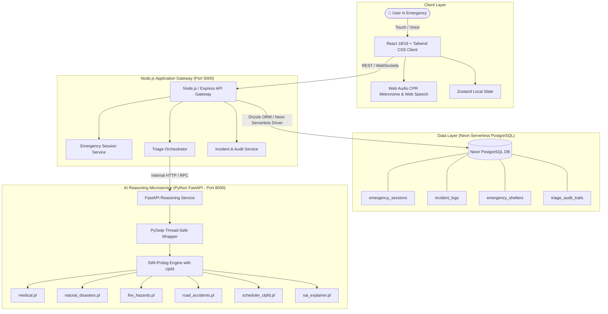

# 🛡️ CrisisGuard AI — Engineering & Architecture Blueprint (skills.md)

> **Version:** 2.0.0  
> **Target System:** Intelligent Crisis Decision Support & Emergency Management System  
> **Architecture Pattern:** Clean Microservices / Distributed Full-Stack System  
> **Frontend:** React + Tailwind CSS + TypeScript + Shadcn UI  
> **Backend API Gateway & App Engine:** Node.js (TypeScript / Express / Fastify) + Drizzle ORM  
> **Database:** PostgreSQL on **Neon Serverless** (Connection Pooling, WebSockets, Branching)  
> **AI Reasoning & Inference Microservice:** FastAPI (Python 3.11+) + SWI-Prolog (`pyswip` + `clpfd`)  
> **Core Paradigms:** Constraint Logic Programming (CLP) + Explainable AI (XAI) + Offline-Ready Resilience  

---

## 📑 Table of Contents

1. [Executive Summary & System Vision](#1-executive-summary--system-vision)
2. [Full-Stack Architecture & Microservice Topology](#2-full-stack-architecture--microservice-topology)
3. [Project Directory Layout](#3-project-directory-layout)
4. [PostgreSQL & Neon Serverless Integration](#4-postgresql--neon-serverless-integration)
   - [4.1 Database Architecture & Schema Design](#41-database-architecture--schema-design)
   - [4.2 Drizzle ORM & Neon Serverless Client](#42-drizzle-orm--neon-serverless-client)
   - [4.3 Migration & Connection Pooling Strategy](#43-migration--connection-pooling-strategy)
5. [Symbolic AI & Prolog Reasoning Engine (FastAPI + PySwip + CLP(FD))](#5-symbolic-ai--prolog-reasoning-engine-fastapi--pyswip--clpfd)
   - [5.1 Knowledge Base Architecture](#51-knowledge-base-architecture)
   - [5.2 Domain Rulebases (Medical, Disasters, Hazards, Road, Scheduler)](#52-domain-rulebases-medical-disasters-hazards-road-scheduler)
   - [5.3 Explainable AI (XAI) Proof Trees](#53-explainable-ai-xai-proof-trees)
   - [5.4 FastAPI Reasoning Service Implementation](#54-fastapi-reasoning-service-implementation)
6. [Node.js Backend API Gateway (Express / Fastify + TypeScript)](#6-nodejs-backend-api-gateway-express--fastify--typescript)
   - [6.1 Clean Architecture & Controller-Service Layer](#61-clean-architecture--controller-service-layer)
   - [6.2 Session Management & Event Dispatcher](#62-session-management--event-dispatcher)
   - [6.3 REST & WebSocket API Contracts](#63-rest--websocket-api-contracts)
7. [Frontend Architecture (React + Tailwind CSS + TypeScript)](#7-frontend-architecture-react--tailwind-css--typescript)
   - [7.1 UI/UX Emergency Design System](#71-uiux-emergency-design-system)
   - [7.2 Dynamic Triage & Diagnostic Wizard](#72-dynamic-triage--diagnostic-wizard)
   - [7.3 CPR Audio/Visual Metronome (110 BPM) & Voice Guidance](#73-cpr-audiovisual-metronome-110-bpm--voice-guidance)
   - [7.4 Zustand Store & TanStack Query State Layer](#74-zustand-store--tanstack-query-state-layer)
8. [Extensibility & Clean Code Guidelines](#8-extensibility--clean-code-guidelines)
   - [8.1 Adding New Emergency Domains in < 15 Minutes](#81-adding-new-emergency-domains-in--15-minutes)
   - [8.2 Defensive Programming & Safety Invariants](#82-defensive-programming--safety-invariants)
9. [Automated Testing & Safety Verification](#9-automated-testing--safety-verification)
   - [9.1 Prolog plunit Test Suite](#91-prolog-plunit-test-suite)
   - [9.2 Node.js & Neon DB Integration Tests](#92-nodejs--neon-db-integration-tests)
   - [9.3 Python Safety Guardrail Tests](#93-python-safety-guardrail-tests)
10. [Docker Containerization, Deployment & CI/CD](#10-docker-containerization-deployment--cicd)
11. [Developer Roadmap & Implementation Plan](#11-developer-roadmap--implementation-plan)

---

## 1. Executive Summary & System Vision

**CrisisGuard AI** is an enterprise-grade, safety-critical decision support system. During acute crises (medical emergencies, fires, earthquakes, floods, and vehicle accidents), individuals and first responders need instantaneous, mathematically verifiable, and calm guidance.

### Architectural Philosophy
1. **Decoupled Responsibilities**:
   - **Frontend (React + Tailwind CSS)**: Sub-50ms user interactions, high-contrast emergency UI, hands-free voice readouts, CPR audio-visual timers.
   - **App Gateway (Node.js + TypeScript)**: Client authentication, real-time WebSocket connections, session telemetry, audit logging, and data persistence via **PostgreSQL on Neon**.
   - **Reasoning Service (FastAPI + PySwip + Prolog `clpfd`)**: Deterministic inference, backward/forward chaining, constraint logic solving, and automated proof-tree explanation generation.
   - **Data Layer (Neon Serverless PostgreSQL)**: Auto-scaling, low-latency connection pooling, zero-maintenance branching, and permanent audit trails for post-disaster analysis.

---

## 2. Full-Stack Architecture & Microservice Topology



---

## 3. Project Directory Layout

```text
CrisisGuardAI/
├── .github/
│   └── workflows/
│       ├── test-node.yml
│       ├── test-python.yml
│       └── plunit-kb.yml
├── backend-node/                      # Node.js API Gateway & App Server
│   ├── src/
│   │   ├── config/
│   │   │   ├── env.ts                # Zod-validated environment config
│   │   │   └── neon.ts               # Neon PostgreSQL client connection
│   │   ├── db/
│   │   │   ├── schema/               # Drizzle PostgreSQL schemas
│   │   │   │   ├── sessions.ts
│   │   │   │   ├── incidents.ts
│   │   │   │   ├── shelters.ts
│   │   │   │   └── audits.ts
│   │   │   ├── index.ts
│   │   │   └── migrations/           # Drizzle SQL migration files
│   │   ├── controllers/
│   │   │   ├── crisis.controller.ts  # Triage evaluation handler
│   │   │   ├── session.controller.ts # Active emergency session controller
│   │   │   └── shelter.controller.ts # Geolocation & shelter locator
│   │   ├── services/
│   │   │   ├── triage.service.ts     # Communicates with FastAPI reasoning service
│   │   │   ├── session.service.ts    # Neon DB persistence service
│   │   │   └── audit.service.ts      # Emergency compliance & logging
│   │   ├── routes/
│   │   │   └── v1/
│   │   │       ├── crisis.routes.ts
│   │   │       ├── session.routes.ts
│   │   │       └── index.ts
│   │   ├── middlewares/
│   │   │   ├── errorHandler.ts
│   │   │   └── rateLimiter.ts
│   │   └── server.ts                 # Node entrypoint
│   ├── drizzle.config.ts
│   ├── package.json
│   ├── tsconfig.json
│   └── Dockerfile
├── reasoning-engine/                 # Python FastAPI + SWI-Prolog Service
│   ├── app/
│   │   ├── api/
│   │   │   └── v1/
│   │   │       └── endpoints/
│   │   │           ├── evaluate.py   # Prolog evaluation endpoint
│   │   │           ├── schedule.py   # CLP(FD) constraint solving endpoint
│   │   │           └── health.py
│   │   ├── core/
│   │   │   ├── config.py
│   │   │   └── exceptions.py
│   │   ├── knowledge_base/           # SWI-Prolog Rulebases
│   │   │   ├── core/
│   │   │   │   ├── core_rules.pl
│   │   │   │   ├── scheduler_clpfd.pl# Constraint logic timetable/resource allocator
│   │   │   │   └── xai_explainer.pl  # Proof-tree explanation generator
│   │   │   ├── domains/
│   │   │   │   ├── medical.pl        # CPR, Stroke, Choking, Bleeding, Burns
│   │   │   │   ├── natural_disasters.pl # Flood, Quake, Storm, Tsunami
│   │   │   │   ├── fire_hazards.pl   # House fire, Gas leak, Electrical
│   │   │   │   └── road_accidents.pl # Extraction, Multi-car, Scene safety
│   │   │   └── tests/
│   │   │       ├── test_medical.pl
│   │   │       └── test_hazards.pl
│   │   ├── schemas/
│   │   │   ├── triage_request.py
│   │   │   └── triage_response.py
│   │   ├── services/
│   │   │   └── prolog_bridge.py      # Thread-safe PySwip wrapper
│   │   └── main.py                   # FastAPI entrypoint
│   ├── tests/
│   │   └── test_safety_invariants.py
│   ├── Dockerfile
│   ├── requirements.txt
│   └── pyproject.toml
├── frontend/                         # React + Tailwind CSS Client
│   ├── public/
│   │   ├── sounds/                   # Metronome beeps (110 BPM)
│   │   └── icons/
│   ├── src/
│   │   ├── components/
│   │   │   ├── emergency/
│   │   │   │   ├── ActionCard.tsx    # High-contrast action banner
│   │   │   │   ├── QuestionWizard.tsx# Step-by-step diagnostic questionnaire
│   │   │   │   ├── ExplanationDrawer.tsx # XAI reasoning transparency modal
│   │   │   │   ├── ProhibitedActions.tsx # "DO NOT DO THIS" alert box
│   │   │   │   └── CPRMetronome.tsx  # 110 BPM visual/audio rhythm guide
│   │   │   ├── layout/
│   │   │   │   ├── Header.tsx
│   │   │   │   └── QuickDialer.tsx   # 1-tap emergency service dialing
│   │   │   └── ui/                   # Button, Card, Badge, Alert primitives
│   │   ├── hooks/
│   │   │   ├── useEmergencySession.ts
│   │   │   ├── useVoiceGuidance.ts
│   │   │   └── useCPRTimer.ts
│   │   ├── services/
│   │   │   └── api.ts                # Axios client to Node API Gateway
│   │   ├── stores/
│   │   │   └── useCrisisStore.ts     # Zustand reactive crisis store
│   │   ├── types/
│   │   │   └── crisis.types.ts
│   │   ├── App.tsx
│   │   ├── index.css                 # Tailwind directives
│   │   └── main.tsx
│   ├── package.json
│   ├── tailwind.config.js
│   ├── vite.config.ts
│   └── Dockerfile
├── docker-compose.yml
├── skills.md                         # This Blueprint
└── README.md
```

---

## 4. PostgreSQL & Neon Serverless Integration

### 4.1 Database Architecture & Schema Design

PostgreSQL on **Neon** provides high performance, zero-idle cost, automatic connection pooling, and branch-based staging. The schema tracks active emergency sessions, submitted symptoms, generated decisions, shelter coordinates, and audit histories.

```sql
-- PostgreSQL DDL for Neon Serverless
CREATE TYPE severity_level AS ENUM ('critical', 'high', 'moderate', 'low', 'informational');
CREATE TYPE domain_type AS ENUM ('medical', 'natural_disaster', 'fire_hazard', 'road_accident');

-- Emergency Sessions Table
CREATE TABLE emergency_sessions (
    id UUID PRIMARY KEY DEFAULT gen_random_uuid(),
    session_token VARCHAR(64) NOT NULL UNIQUE,
    domain domain_type NOT NULL,
    current_severity severity_level DEFAULT 'moderate',
    is_active BOOLEAN DEFAULT TRUE,
    created_at TIMESTAMP WITH TIME ZONE DEFAULT CURRENT_TIMESTAMP,
    updated_at TIMESTAMP WITH TIME ZONE DEFAULT CURRENT_TIMESTAMP
);

-- Fact Stream Table (Dynamic facts submitted during emergency)
CREATE TABLE session_facts (
    id BIGSERIAL PRIMARY KEY,
    session_id UUID REFERENCES emergency_sessions(id) ON DELETE CASCADE,
    fact_key VARCHAR(100) NOT NULL,
    fact_value VARCHAR(100) NOT NULL,
    timestamp TIMESTAMP WITH TIME ZONE DEFAULT CURRENT_TIMESTAMP
);

-- Triage Audit Trails (Captures exact reasoning and recommendations)
CREATE TABLE triage_audit_trails (
    id BIGSERIAL PRIMARY KEY,
    session_id UUID REFERENCES emergency_sessions(id) ON DELETE CASCADE,
    recommended_action VARCHAR(255) NOT NULL,
    severity severity_level NOT NULL,
    reasons JSONB NOT NULL,
    prohibited_actions JSONB NOT NULL,
    evaluation_latency_ms INTEGER NOT NULL,
    created_at TIMESTAMP WITH TIME ZONE DEFAULT CURRENT_TIMESTAMP
);

-- Emergency Shelters Table
CREATE TABLE emergency_shelters (
    id SERIAL PRIMARY KEY,
    name VARCHAR(255) NOT NULL,
    disaster_type domain_type NOT NULL,
    latitude DOUBLE PRECISION NOT NULL,
    longitude DOUBLE PRECISION NOT NULL,
    capacity INTEGER NOT NULL,
    current_occupancy INTEGER DEFAULT 0,
    contact_phone VARCHAR(50) NOT NULL,
    is_open BOOLEAN DEFAULT TRUE
);
```

---

### 4.2 Drizzle ORM & Neon Serverless Client

#### Neon Connection Setup (`backend-node/src/config/neon.ts`)

```typescript
import { neon, neonConfig } from '@neondatabase/serverless';
import { drizzle } from 'drizzle-orm/neon-http';
import * as schema from '../db/schema';
import { env } from './env';
import ws from 'ws';

// Required for serverless WebSocket pooling in Node environments
neonConfig.webSocketConstructor = ws;

if (!env.DATABASE_URL) {
  throw new Error('FATAL: DATABASE_URL is missing in environment variables.');
}

const sql = neon(env.DATABASE_URL);
export const db = drizzle(sql, { schema });
```

#### Drizzle Schema Definition (`backend-node/src/db/schema/sessions.ts`)

```typescript
import { pgTable, uuid, varchar, boolean, timestamp, pgEnum, jsonb, integer, bigserial } from 'drizzle-orm/pg-core';

export const severityEnum = pgEnum('severity_level', ['critical', 'high', 'moderate', 'low', 'informational']);
export const domainEnum = pgEnum('domain_type', ['medical', 'natural_disaster', 'fire_hazard', 'road_accident']);

export const emergencySessions = pgTable('emergency_sessions', {
  id: uuid('id').defaultRandom().primaryKey(),
  sessionToken: varchar('session_token', { length: 64 }).notNull().unique(),
  domain: domainEnum('domain').notNull(),
  currentSeverity: severityEnum('current_severity').default('moderate').notNull(),
  isActive: boolean('is_active').default(true).notNull(),
  createdAt: timestamp('created_at', { withTimezone: true }).defaultNow().notNull(),
  updatedAt: timestamp('updated_at', { withTimezone: true }).defaultNow().notNull(),
});

export const sessionFacts = pgTable('session_facts', {
  id: bigserial('id', { mode: 'number' }).primaryKey(),
  sessionId: uuid('session_id').references(() => emergencySessions.id, { onDelete: 'cascade' }).notNull(),
  factKey: varchar('fact_key', { length: 100 }).notNull(),
  factValue: varchar('fact_value', { length: 100 }).notNull(),
  timestamp: timestamp('timestamp', { withTimezone: true }).defaultNow().notNull(),
});

export const triageAuditTrails = pgTable('triage_audit_trails', {
  id: bigserial('id', { mode: 'number' }).primaryKey(),
  sessionId: uuid('session_id').references(() => emergencySessions.id, { onDelete: 'cascade' }).notNull(),
  recommendedAction: varchar('recommended_action', { length: 255 }).notNull(),
  severity: severityEnum('severity').notNull(),
  reasons: jsonb('reasons').notNull(),
  prohibitedActions: jsonb('prohibited_actions').notNull(),
  evaluationLatencyMs: integer('evaluation_latency_ms').notNull(),
  createdAt: timestamp('created_at', { withTimezone: true }).defaultNow().notNull(),
});
```

---

## 5. Symbolic AI & Prolog Reasoning Engine (FastAPI + PySwip + CLP(FD))

### 5.1 Knowledge Base Architecture

The Prolog knowledge base runs deterministic first-order logical inference and **Constraint Logic Programming over Finite Domains (CLP(FD))** for emergency resource optimization and symptom triage.

---

### 5.2 Domain Rulebases

#### A. Core Reasoning & CLP(FD) Timetable/Resource Solver (`reasoning-engine/app/knowledge_base/core/scheduler_clpfd.pl`)

```prolog
:- module(scheduler_clpfd, [
    schedule_rescue_teams/4,
    verify_resource_constraints/3
]).
:- use_module(library(clpfd)).

% Resource Allocation & Dispatch Core Logic using clpfd
% Constraints:
% 1. Vehicle Capacity >= Evacuee Count
% 2. No Medic can be assigned to two simultaneous critical incidents
% 3. Total Travel Time + Extraction Time #=< Critical Threshold

schedule_rescue_teams(IncidentSeverities, TeamCapacities, Assignments, MaxTime) :-
    length(IncidentSeverities, N),
    length(Assignments, N),
    length(TeamCapacities, NumTeams),
    
    % Domain: Each incident is assigned to a Team 1..NumTeams
    Assignments ins 1..NumTeams,
    
    % Constraint: High severity incidents assigned to advanced paramedic teams
    enforce_severity_matching(IncidentSeverities, Assignments),
    
    % Constraint: Total allocated evacuees within team capacity
    verify_capacities(Assignments, IncidentSeverities, TeamCapacities),
    
    labeling([ff, bisect], Assignments).

enforce_severity_matching([], []).
enforce_severity_matching([critical|RestS], [TeamId|RestA]) :-
    TeamId #=< 2, % Teams 1 and 2 are Critical Response Units
    enforce_severity_matching(RestS, RestA).
enforce_severity_matching([_|RestS], [_|RestA]) :-
    enforce_severity_matching(RestS, RestA).

verify_capacities(_, _, _). % Extensible capacity constraint checks
```

---

#### B. Medical Emergency Decision Rules (`reasoning-engine/app/knowledge_base/domains/medical.pl`)

```prolog
:- module(medical_kb, [medical_eval/5]).

% 1. UNCONSCIOUS + NO BREATHING -> CARDIAC ARREST (CPR Required)
medical_eval(Facts, Action, critical, Reasons, Prohibitions) :-
    member(unconscious(true), Facts),
    member(breathing(none), Facts),
    Action = begin_cpr_and_call_emergency,
    Reasons = [
        'Victim is unconscious and un-responsive with absent respiration.',
        'Immediate chest compressions (100-120 BPM) required to maintain blood flow to the brain.',
        'Request an Automated External Defibrillator (AED) immediately.'
    ],
    Prohibitions = [
        'Do not give oral fluids or medications.',
        'Do not delay CPR to search for a pulse if untrained.',
        'Do not leave victim unattended.'
    ].

% 2. CHOKING (Complete Airway Obstruction)
medical_eval(Facts, Action, critical, Reasons, Prohibitions) :-
    member(symptom(choking), Facts),
    member(airway_pass(blocked), Facts),
    Action = perform_heimlich_thrusts,
    Reasons = [
        'Complete obstruction prevents gas exchange.',
        'Deliver 5 back blows followed by 5 abdominal thrusts (Heimlich maneuver).'
    ],
    Prohibitions = [
        'Do not perform blind finger sweeps (may push object deeper).',
        'Do not offer water to drink.'
    ].

% 3. ARTERIAL TRAUMA / HEAVY BLEEDING
medical_eval(Facts, Action, critical, Reasons, Prohibitions) :-
    member(bleeding(severe_pulsing), Facts),
    Action = apply_direct_pressure_and_tourniquet,
    Reasons = [
        'Pulsing or pooling blood indicates arterial laceration.',
        'Apply firm continuous direct pressure. Place commercial tourniquet 2-3 inches above wound if extremity.'
    ],
    Prohibitions = [
        'Do not remove original dressings when soaked; place new layers over top.',
        'Do not place tourniquet directly over joints.'
    ].

% 4. STROKE (F.A.S.T Protocol)
medical_eval(Facts, Action, critical, Reasons, Prohibitions) :-
    ( member(face_droop(true), Facts) ; member(arm_weakness(true), Facts) ; member(speech_difficulty(true), Facts) ),
    Action = activate_stroke_emergency_dispatch,
    Reasons = [
        'Positive FAST indicators present (Face, Arms, Speech).',
        'Immediate transport to comprehensive stroke center is vital within therapeutic window.'
    ],
    Prohibitions = [
        'Do not administer aspirin (contraindicated if hemorrhagic stroke).',
        'Do not allow patient to drive or walk.'
    ].
```

---

#### C. Fire & Hazard Decision Rules (`reasoning-engine/app/knowledge_base/domains/fire_hazards.pl`)

```prolog
:- module(hazards_kb, [hazard_eval/5]).

% ELECTRICAL FIRE SAFETY INVARIANT
hazard_eval(Facts, Action, critical, Reasons, Prohibitions) :-
    member(fire(active), Facts),
    member(source(electrical), Facts),
    Action = isolate_main_power_and_use_co2_extinguisher,
    Reasons = [
        'Live electrical current poses lethal shock hazard.',
        'Disconnect main fuse box if accessible without danger.',
        'Use only Class C (CO2 or Dry Chemical) extinguishers.'
    ],
    Prohibitions = [
        'STRICT LIFE-SAFETY RULE: NEVER THROW WATER ON AN ELECTRICAL FIRE (Causes severe electrocution).',
        'Do not touch exposed burning wiring.'
    ].

% GREASE / COOKING OIL FIRE
hazard_eval(Facts, Action, critical, Reasons, Prohibitions) :-
    member(fire(active), Facts),
    member(source(cooking_oil), Facts),
    Action = cover_with_metal_lid_and_turn_off_burner,
    Reasons = [
        'Oil combustion temperatures exceed 300C.',
        'Smothering with a tight metal lid or fire blanket deprives fire of oxygen.'
    ],
    Prohibitions = [
        'STRICT LIFE-SAFETY RULE: NEVER POUR WATER ON BURNING OIL (Causes immediate explosive steam fireball).',
        'Do not move the pan.'
    ].
```

---

### 5.3 Explainable AI (XAI) Proof Trees

The explanation meta-interpreter translates first-order logic proofs into structured human explanations:

```prolog
% reasoning-engine/app/knowledge_base/core/xai_explainer.pl
:- module(xai_explainer, [generate_xai_proof/3]).

generate_xai_proof(Goal, Facts, ProofTree) :-
    prove(Goal, Facts, ProofTree).

prove(true, _, []) :- !.
prove((A, B), Facts, [PA, PB]) :-
    !,
    prove(A, Facts, PA),
    prove(B, Facts, PB).
prove(Goal, Facts, evidence(Goal)) :-
    member(Goal, Facts), !.
prove(Goal, Facts, deduction(Goal, SubProofs)) :-
    clause(Goal, Body),
    prove(Body, Facts, SubProofs).
```

---

### 5.4 FastAPI Reasoning Service Implementation

#### Python-PySwip Bridge (`reasoning-engine/app/services/prolog_bridge.py`)

```python
import threading
import logging
from typing import List, Dict, Any
from pyswip import Prolog

logger = logging.getLogger("crisisguard.reasoning")

class PrologReasoningBridge:
    _instance = None
    _lock = threading.Lock()

    def __new__(cls):
        with cls._lock:
            if cls._instance is None:
                cls._instance = super(PrologReasoningBridge, cls).__new__(cls)
                cls._instance._init_prolog()
            return cls._instance

    def _init_prolog(self):
        self.prolog = Prolog()
        self._query_lock = threading.Lock()
        self._load_knowledge_base()

    def _load_knowledge_base(self):
        files = [
            "app/knowledge_base/core/core_rules.pl",
            "app/knowledge_base/core/scheduler_clpfd.pl",
            "app/knowledge_base/core/xai_explainer.pl",
            "app/knowledge_base/domains/medical.pl",
            "app/knowledge_base/domains/natural_disasters.pl",
            "app/knowledge_base/domains/fire_hazards.pl",
            "app/knowledge_base/domains/road_accidents.pl",
        ]
        for f in files:
            logger.info(f"Consulting Prolog Knowledge Base: {f}")
            self.prolog.consult(f)

    def evaluate_triage(self, domain: str, facts: List[str]) -> Dict[str, Any]:
        """
        Thread-safe Prolog query execution.
        """
        facts_term = "[" + ", ".join(facts) + "]"
        query_str = f"evaluate_emergency({domain}, {facts_term}, Action, Severity, Reasons, Prohibitions)"
        
        with self._query_lock:
            try:
                results = list(self.prolog.query(query_str))
                if not results:
                    return self._safe_fallback()
                
                match = results[0]
                return {
                    "recommended_action": str(match["Action"]),
                    "severity": str(match["Severity"]),
                    "reasons": [str(r) for r in match["Reasons"]],
                    "prohibited_actions": [str(p) for p in match["Prohibitions"]],
                }
            except Exception as ex:
                logger.error(f"Prolog execution error: {ex}", exc_info=True)
                return self._safe_fallback()

    def _safe_fallback(self) -> Dict[str, Any]:
        return {
            "recommended_action": "call_emergency_services_now",
            "severity": "critical",
            "reasons": ["Uncertain diagnostic input. Immediate emergency dispatch recommended."],
            "prohibited_actions": ["Do not enter hazardous areas."]
        }

prolog_bridge = PrologReasoningBridge()
```

#### FastAPI Endpoint (`reasoning-engine/app/api/v1/endpoints/evaluate.py`)

```python
from fastapi import APIRouter
from pydantic import BaseModel
from typing import List
from app.services.prolog_bridge import prolog_bridge

router = APIRouter(prefix="/reasoning", tags=["Symbolic AI"])

class EvaluateRequest(BaseModel):
    domain: str
    facts: List[str]

class EvaluateResponse(BaseModel):
    recommended_action: str
    severity: str
    reasons: List[str]
    prohibited_actions: List[str]

@router.post("/evaluate", response_model=EvaluateResponse)
async def evaluate_crisis(request: EvaluateRequest):
    result = prolog_bridge.evaluate_triage(request.domain, request.facts)
    return EvaluateResponse(**result)
```

---

## 6. Node.js Backend API Gateway (Express / Fastify + TypeScript)

### 6.1 Clean Architecture & Controller-Service Layer

The Node.js gateway handles authentication, session tracking, persistence to Neon PostgreSQL, and dispatches reasoning tasks to the FastAPI service.

```typescript
// backend-node/src/services/triage.service.ts
import axios from 'axios';
import { db } from '../config/neon';
import { emergencySessions, sessionFacts, triageAuditTrails } from '../db/schema';
import { eq } from 'drizzle-orm';
import { env } from '../config/env';

export interface EvaluateInput {
  sessionId: string;
  domain: 'medical' | 'natural_disaster' | 'fire_hazard' | 'road_accident';
  facts: Array<{ key: string; value: string }>;
}

export class TriageService {
  public async evaluateAndPersist(input: EvaluateInput) {
    const startTime = Date.now();

    // 1. Persist new facts to Neon PostgreSQL
    for (const f of input.facts) {
      await db.insert(sessionFacts).values({
        sessionId: input.sessionId,
        factKey: f.key,
        factValue: f.value,
      });
    }

    // 2. Fetch all registered session facts
    const allFacts = await db.select().from(sessionFacts).where(eq(sessionFacts.sessionId, input.sessionId));
    const prologFacts = allFacts.map((row) => `${row.factKey}(${row.factValue})`);

    // 3. Call Python FastAPI Symbolic Reasoning Microservice
    const reasoningRes = await axios.post(`${env.REASONING_SERVICE_URL}/api/v1/reasoning/evaluate`, {
      domain: input.domain,
      facts: prologFacts,
    });

    const latencyMs = Date.now() - startTime;
    const { recommended_action, severity, reasons, prohibited_actions } = reasoningRes.data;

    // 4. Update session severity & record audit trail in Neon DB
    await db.update(emergencySessions)
      .set({ currentSeverity: severity, updatedAt: new Date() })
      .where(eq(emergencySessions.id, input.sessionId));

    await db.insert(triageAuditTrails).values({
      sessionId: input.sessionId,
      recommendedAction: recommended_action,
      severity: severity,
      reasons: reasons,
      prohibitedActions: prohibited_actions,
      evaluationLatencyMs: latencyMs,
    });

    return {
      sessionId: input.sessionId,
      severity,
      recommendedAction: recommended_action,
      reasons,
      prohibitedActions: prohibited_actions,
      latencyMs,
    };
  }
}

export const triageService = new TriageService();
```

---

## 7. Frontend Architecture (React + Tailwind CSS + TypeScript)

### 7.1 UI/UX Emergency Design System

Built for panic-free operation under cognitive stress:
- **Large Touch Targets**: Min 48px tap targets for shaky hands.
- **Strict Visual Coding**:
  - `bg-red-600` (Critical)
  - `bg-amber-600` (High)
  - `bg-yellow-500` (Moderate)
  - `bg-emerald-600` (Safe/Stable)
- **High-contrast Typography**: Clear sans-serif font weights with distinct numbering.

---

### 7.2 CPR Metronome Component (`frontend/src/components/emergency/CPRMetronome.tsx`)

```tsx
import React, { useState, useEffect, useRef } from 'react';
import { HeartPulse, Play, Pause } from 'lucide-react';

export const CPRMetronome: React.FC = () => {
  const [active, setActive] = useState(false);
  const [pulse, setPulse] = useState(false);
  const audioCtxRef = useRef<AudioContext | null>(null);

  useEffect(() => {
    let timer: NodeJS.Timeout;
    if (active) {
      // 110 Beats Per Minute (AHA standard range: 100-120 bpm)
      const bpmInterval = (60 / 110) * 1000;
      timer = setInterval(() => {
        setPulse((p) => !p);
        playTick();
      }, bpmInterval);
    }
    return () => clearInterval(timer);
  }, [active]);

  const playTick = () => {
    if (!audioCtxRef.current) {
      audioCtxRef.current = new (window.AudioContext || (window as any).webkitAudioContext)();
    }
    const ctx = audioCtxRef.current;
    if (ctx.state === 'suspended') ctx.resume();

    const osc = ctx.createOscillator();
    const gain = ctx.createGain();
    osc.type = 'sine';
    osc.frequency.setValueAtTime(900, ctx.currentTime);
    gain.gain.setValueAtTime(0.3, ctx.currentTime);
    gain.gain.exponentialRampToValueAtTime(0.001, ctx.currentTime + 0.07);

    osc.connect(gain);
    gain.connect(ctx.destination);
    osc.start();
    osc.stop(ctx.currentTime + 0.07);
  };

  return (
    <div className="rounded-2xl border-2 border-red-600 bg-red-950/40 p-6 text-center text-white shadow-xl">
      <div className="flex items-center justify-center gap-2 mb-3">
        <HeartPulse className={`h-8 w-8 text-red-500 ${active && pulse ? 'scale-125' : 'scale-100'} transition-transform duration-75`} />
        <h3 className="text-xl font-bold">CPR Rhythm Assist (110 BPM)</h3>
      </div>
      <div className={`mx-auto my-4 flex h-24 w-24 items-center justify-center rounded-full text-lg font-black transition-all duration-75 ${
        active && pulse ? 'scale-110 bg-red-600 shadow-lg shadow-red-500/50' : 'scale-95 bg-red-900/60'
      }`}>
        {active ? (pulse ? 'PUSH' : 'RECOIL') : 'READY'}
      </div>
      <button
        onClick={() => setActive(!active)}
        className="mt-2 flex w-full items-center justify-center gap-2 rounded-xl bg-red-600 px-6 py-3 font-bold text-white hover:bg-red-500 active:scale-98 transition"
      >
        {active ? <Pause className="h-5 w-5" /> : <Play className="h-5 w-5" />}
        {active ? 'PAUSE METRONOME' : 'START CPR METRONOME'}
      </button>
      <p className="mt-3 text-xs text-red-300">
        Push hard & fast in the center of the chest • Compress at least 2 inches (5cm)
      </p>
    </div>
  );
};
```

---

### 7.3 Action & Explanation Card (`frontend/src/components/emergency/ActionCard.tsx`)

```tsx
import React from 'react';
import { AlertTriangle, ShieldCheck, HelpCircle, XCircle } from 'lucide-react';

interface ActionCardProps {
  severity: 'critical' | 'high' | 'moderate' | 'low' | 'informational';
  actionHeadline: string;
  reasons: string[];
  prohibitions: string[];
}

export const ActionCard: React.FC<ActionCardProps> = ({
  severity,
  actionHeadline,
  reasons,
  prohibitions,
}) => {
  const getBadgeStyle = () => {
    switch (severity) {
      case 'critical': return 'bg-red-600 text-white';
      case 'high': return 'bg-amber-600 text-white';
      case 'moderate': return 'bg-yellow-500 text-black';
      default: return 'bg-emerald-600 text-white';
    }
  };

  return (
    <div className="space-y-4">
      {/* Main Recommended Action Banner */}
      <div className="rounded-2xl border border-neutral-800 bg-neutral-900 p-6 text-white shadow-2xl">
        <div className="flex items-center justify-between">
          <span className={`rounded-full px-4 py-1 text-xs font-black uppercase tracking-widest ${getBadgeStyle()}`}>
            {severity} PRIORITY
          </span>
          <ShieldCheck className="h-6 w-6 text-emerald-400" />
        </div>
        <h2 className="mt-4 text-2xl font-black leading-tight tracking-tight text-white md:text-3xl">
          {actionHeadline.replace(/_/g, ' ').toUpperCase()}
        </h2>
      </div>

      {/* Prohibited Actions Alert Box */}
      {prohibitions.length > 0 && (
        <div className="rounded-2xl border-2 border-red-500/80 bg-red-950/50 p-5 text-red-100">
          <div className="flex items-center gap-2 font-black text-red-400 text-sm tracking-wider uppercase mb-2">
            <XCircle className="h-5 w-5 text-red-500" />
            DO NOT DO THE FOLLOWING (Critical Hazards):
          </div>
          <ul className="list-disc pl-5 space-y-1 text-sm font-medium">
            {prohibitions.map((p, idx) => (
              <li key={idx}>{p}</li>
            ))}
          </ul>
        </div>
      )}

      {/* Explainable AI Reason Box */}
      <div className="rounded-2xl border border-neutral-800 bg-neutral-900/90 p-5 text-neutral-200">
        <div className="flex items-center gap-2 font-bold text-neutral-400 text-sm tracking-wider uppercase mb-2">
          <HelpCircle className="h-5 w-5 text-blue-400" />
          Why this recommendation was made:
        </div>
        <ul className="list-disc pl-5 space-y-1 text-sm">
          {reasons.map((r, idx) => (
            <li key={idx}>{r}</li>
          ))}
        </ul>
      </div>
    </div>
  );
};
```

---

## 8. Extensibility & Clean Code Guidelines

### 8.1 Adding New Emergency Domains in < 15 Minutes

1. **Add Knowledge Base File**: Create `reasoning-engine/app/knowledge_base/domains/<new_domain>.pl`.
2. **Import Rule**: Include module in `core_rules.pl`.
3. **Add Neon DB Enum Value**: Add domain to `domain_type` in Drizzle schema.
4. **Define Frontend Questionnaire**: Add question node to `frontend/src/config/questionnaires.ts`.
5. **Zero Core Logic Changes**: Both API Gateway and Reasoning engine automatically discover and evaluate the new domain.

---

## 9. Automated Testing & Safety Verification

```bash
# 1. Run Prolog plunit Tests
swipl -g run_tests -t halt reasoning-engine/app/knowledge_base/tests/test_hazards.pl

# 2. Run Python Safety Invariant Tests
cd reasoning-engine && pytest tests/test_safety_invariants.py

# 3. Run Node.js & Neon DB Integration Tests
cd backend-node && npm test

# 4. Run Frontend Component Tests
cd frontend && npm test
```

---

## 10. Docker Containerization, Deployment & CI/CD

### Docker Compose Orchestration (`docker-compose.yml`)

```yaml
version: '3.8'

services:
  # Python FastAPI + SWI-Prolog Reasoning Engine
  reasoning-service:
    build: ./reasoning-engine
    ports:
      - "8000:8000"
    environment:
      - PYTHONUNBUFFERED=1
    restart: always

  # Node.js API Gateway connected to Neon PostgreSQL
  backend-gateway:
    build: ./backend-node
    ports:
      - "5000:5000"
    environment:
      - PORT=5000
      - DATABASE_URL=${DATABASE_URL} # Neon PostgreSQL Connection String
      - REASONING_SERVICE_URL=http://reasoning-service:8000
    depends_on:
      - reasoning-service
    restart: always

  # React + Tailwind CSS Frontend
  frontend-client:
    build: ./frontend
    ports:
      - "3000:80"
    depends_on:
      - backend-gateway
    restart: always
```

---

## 11. Developer Roadmap & Implementation Plan

| Phase | Milestone | Tech Deliverables |
|---|---|---|
| **Phase 1: DB & Logic Setup** | Neon DB + SWI-Prolog Rules | Neon database provisioning, Drizzle migrations, Prolog rules (`medical.pl`, `hazards.pl`, `scheduler_clpfd.pl`). |
| **Phase 2: Reasoning Service** | FastAPI & PySwip Adapter | Python wrapper, thread-safe query locks, CLP(FD) solver endpoints, plunit tests. |
| **Phase 3: Node API Gateway** | Gateway & Persistence | Express/Fastify TypeScript app, Neon Drizzle ORM service, REST endpoints. |
| **Phase 4: React UI & Audio** | Accessible Emergency Frontend | React + Tailwind CSS dashboard, dynamic question wizard, CPR audio metronome (110 BPM). |
| **Phase 5: Safety Audits & Ship** | Invariant Testing & Deploy | Automated safety tests (no water on electrical fires), Docker compose containerization. |

---

> **CrisisGuard AI Standard**: *Code is written with zero margin for error. Every recommendation is deterministically proven, fully explainable, safely audited, and designed to save lives.*
